<p align="center">
  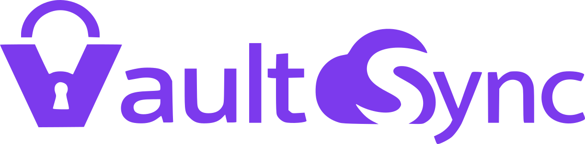
</p>

<p align="center">
  <b>Cloud sync plugin for Obsidian</b>
</p>

<p align="center">
  <a href="README.md">🇺🇸 English</a> | <a href="README_ja.md">🇯🇵 日本語</a>
</p>

<p align="center">
  <a href="https://opensource.org/licenses/MIT"></a>
  <a href="https://github.com/c-ardinal/obsidian-vault-sync/releases"></a>
  <a href="https://github.com/c-ardinal/obsidian-vault-sync/actions/workflows/test.yml"></a>
  
</p>

A high-speed, intelligent cloud storage sync plugin for Obsidian.
Leveraging cloud storage, it provides robust data consistency and a fast synchronization experience across PC and mobile devices (iOS/Android).
Supported cloud storage providers are listed below; others are planned.

- [x] Google Drive

---

## ✨ Key Features

- **Intelligent Sync (Index Shortcut)**:
    - Combines MD5 hash computation with Obsidian's built-in file change detection to detect all changes in the vault quickly and efficiently. Dotfile changes are also detected.
- **Smart Merge (3-way Merge)**:
    - Even when conflicts arise from simultaneous editing on multiple devices or sync timing differences, the plugin safely protects data via lock control while automatically merging wherever possible.
- **Revision History & Diff Viewer**:
    - Retrieves file revisions from cloud storage to display diffs against the local version and restore past versions.
- **Mobile Optimized**:
    - Built on the `fetch` API for both desktop and mobile.
    - Features auto-sync on edit-stop or save, and layout change triggers (e.g., when switching tabs).
- **Granular Sync Settings**:
    - Selectively sync settings, plugins, themes, and hotkeys within `.obsidian`. Cache and temporary files are automatically excluded.
- **Secure Authentication & Storage**:
    - OAuth2 authentication via the built-in auth proxy (no setup required) or your own Client ID/Secret with PKCE.
    - Credentials are separated from settings and stored securely via Obsidian's SecretStorage API.
- **Background Transfer**:
    - Large files are uploaded and downloaded in the background without blocking the UI. Configurable thresholds and concurrency limits.
- **End-to-End Encryption (E2EE)**:
    - By installing the [E2EE Engine](https://github.com/c-ardinal/obsidian-vault-sync-e2ee-engine) separately, vault data can be encrypted. Files are encrypted before upload and decrypted after download — no plaintext is stored in the cloud.

|               Transfer Status               |                   Selective Sync                   |
| :-----------------------------------------: | :------------------------------------------------: |
| 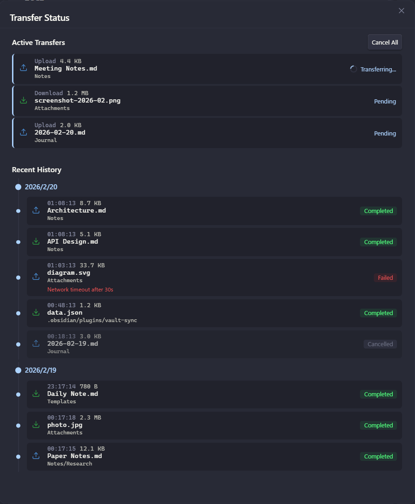 | 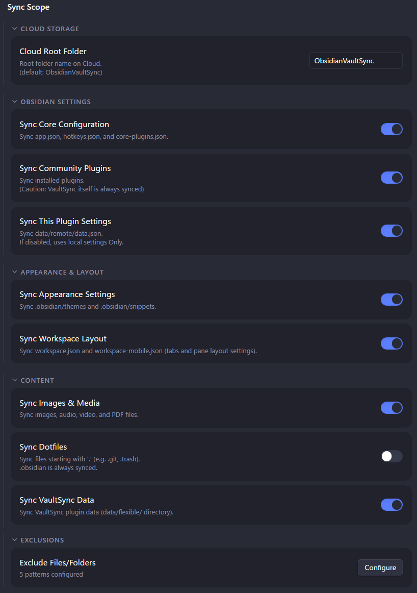 |

---

## 📖 Usage

### Running Synchronization

- **Manual Sync**:
    - **Ribbon Icon**:
        - Click the sync icon in the left toolbar to start a Smart Sync.
    - **Command Palette**:
        - Press `Ctrl+P` (or `Cmd+P`) and select `Vault-Sync: Sync with Cloud`.
- **Auto-Sync**:
    - Depending on your settings, sync triggers on file save, when you stop editing, or at fixed intervals.

|             Sync Notifications              |                     Sync Triggers                      |
| :-----------------------------------------: | :----------------------------------------------------: |
| 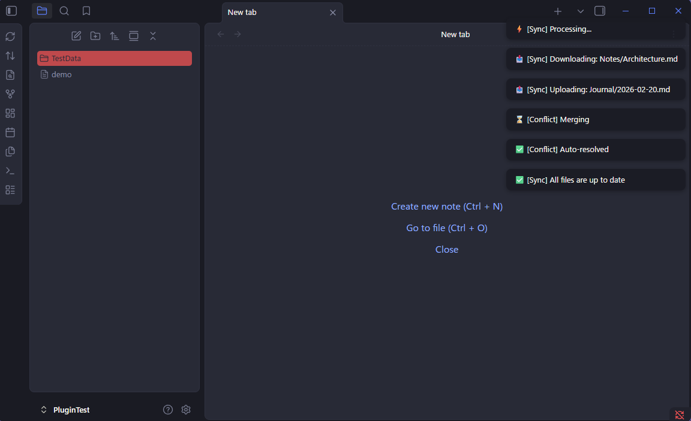 | 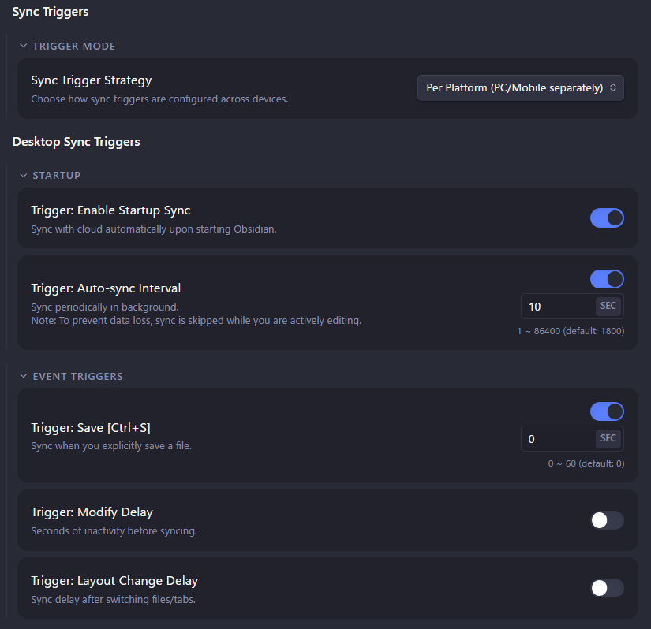 |

### History and Restoration

- **File History**:
    - Right-click a file and select "View History in Cloud (Vault-Sync)" to compare against past revisions on cloud storage.
- **Advanced Diff Viewer**:
    - Provides powerful comparison tools including Unified/Split view toggle, inline character-level highlighting, jump navigation between changes (with looping), and adjustable context lines.
- **Full Scan**:
    - If concerned about consistency, run `Vault-Sync: Audit & Fix Consistency (Full Scan)` from the command palette to force a sync state check.

|              Cloud History              |             Diff Viewer             |
| :-------------------------------------: | :---------------------------------: |
| 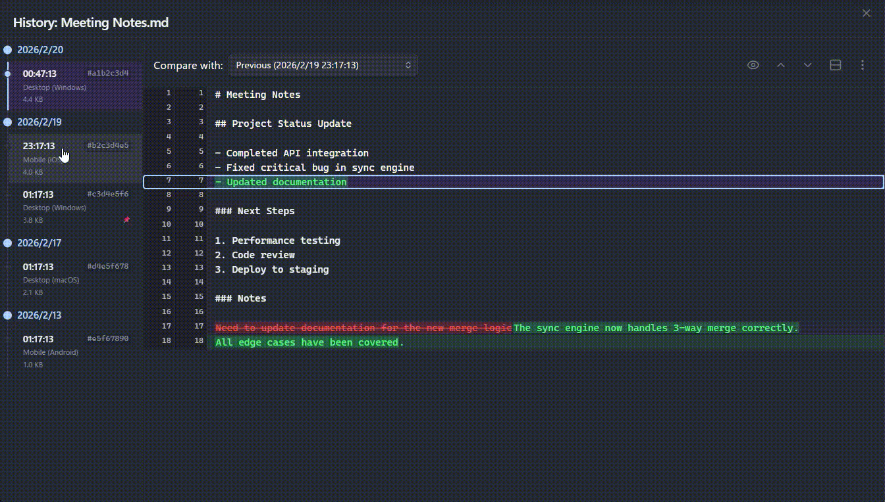 | 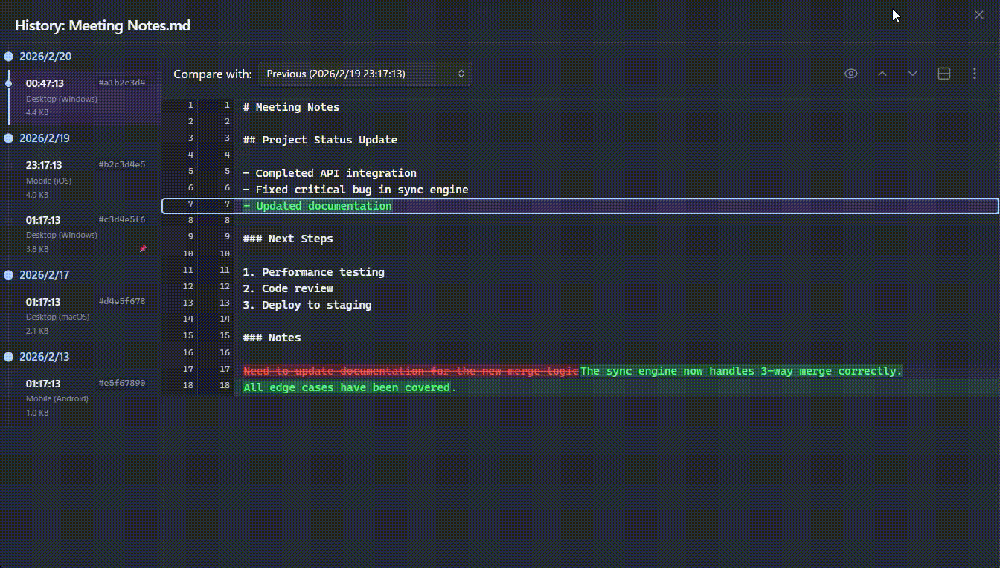 |

---

## 📦 Installation

### Community Plugin (Recommended)

1. Open Obsidian Settings > Community Plugins.
2. Click "Browse" in Community Plugins.
3. Search for `c-ardinal/obsidian-vault-sync` and click "Install".
4. Go back to Settings > Community Plugins and enable "Vault-Sync".

### Via BRAT

1. Install the [BRAT](https://github.com/TfTHacker/obsidian42-brat) plugin from the Obsidian Community Plugins.
2. Open BRAT settings and click **"Add Beta plugin"**.
3. Enter `c-ardinal/obsidian-vault-sync`, select `Latest version`, and click **"Add Plugin"**.
4. Enable "Vault-Sync" in Settings > Community Plugins.

BRAT will automatically check for updates and keep the plugin up to date.

### Manual Installation

1. Download `main.js`, `manifest.json`, and `styles.css` from the [latest release](https://github.com/c-ardinal/obsidian-vault-sync/releases/latest).
2. Create a folder named `obsidian-vault-sync` in your vault's `.obsidian/plugins/` directory.
3. Place the downloaded files into the folder.
4. Enable "Vault-Sync" in Settings > Community Plugins.

---

## 🚀 Login Instructions

Vault-Sync offers three authentication methods. Choose the one that suits your needs.

### Method A: Default (Recommended)

The simplest way to get started. The plugin uses the developer-provided authentication proxy to handle the OAuth login — no Google Cloud setup required.

1. Open Obsidian Settings > "Vault-Sync".
2. Ensure the Login Method is set to **"Default"**.
3. Click the **"Login"** button.
4. A browser will open with the Google login screen.
5. After successful login, you will be automatically redirected back to Obsidian. Completion is confirmed when the success notification appears.
    - If you are not automatically redirected, click the "Open Obsidian" button on the browser screen.
    - If it still doesn't return, manually switch back to the Obsidian app.
6. Restart Obsidian after the success notification appears.

> **Note**: The authentication proxy handles OAuth codes and tokens transiently (in-memory only) and discards them after processing. No vault data passes through the proxy. See the [Privacy Policy](https://obsidian-vault-sync.pages.dev/privacy/) for details.

### Method B: Custom Auth Proxy

Use your own authentication proxy server instead of the default one.

1. Deploy an authentication proxy compatible with the Vault-Sync API (see the `www/functions/` directory for the reference implementation).
2. Open Obsidian Settings > "Vault-Sync".
3. Set the Login Method to **"Use Custom Auth Proxy"**.
4. Enter your proxy URL (must use HTTPS).
5. Click the **"Login"** button and complete the Google login flow.
6. Restart Obsidian after the success notification appears.

### Method C: Client ID / Secret

For full control, create your own Google Cloud Project and use your own OAuth credentials. In this mode, the callback page on Cloudflare Pages is used only as a redirect relay to pass the authorization code back to Obsidian via the `obsidian://` protocol. The plugin then exchanges the code for tokens directly with Google — no credentials or tokens pass through the proxy.

#### 1. Create a Google Cloud Project

1. Access the [Google Cloud Console](https://console.cloud.google.com/).
2. Create a new project.
3. Search for **Google Drive API** in "APIs & Services" > "Library" and click "Enable".

#### 2. Configure OAuth Consent Screen

1. **Create OAuth Consent Screen**:
    1. Go to "APIs & Services" > "OAuth Consent Screen" > "Summary" and click "Get Started".
    2. Enter the required app information. Select "External" for User Type.
    3. Once completed, click "Create".
2. **Add Scopes**:
    1. Under "Data access", select "Add or remove scopes".
    2. Check `.../auth/drive.file` (See, edit, create, and delete only the specific Google Drive files you use with this app).
    3. Click "Update".
    4. Click "Save" at the bottom.
3. **Auth Period Persistence**:
   If the project remains in "Testing" state, re-authentication is required every 7 days.
   To avoid this, the project must be published, but this requires preparing a Terms of Service, Privacy Policy, etc. and passing Google's review. Proceed carefully.

#### 3. Create Credentials (Client ID / Secret)

1. Go to "APIs & Services" > "Credentials" > "Create Credentials" > "OAuth Client ID".
2. Select **"Web Application"** as the Application type.
3. Under "Authorized redirect URIs", click "Add URI".
4. Enter `https://obsidian-vault-sync.pages.dev/api/auth/callback`.
    - This page acts as a redirect relay: it receives the authorization code from Google and forwards it to the Obsidian app via the `obsidian://` protocol. No tokens or credentials are stored on this server.
5. Click "Create".
6. Copy the generated **Client ID** and **Client Secret**.
    - **Important**: The Client Secret is confidential. Never share it with others.

#### 4. Apply to Plugin

1. Open Obsidian Settings > "Vault-Sync".
2. Set the Login Method to **"Use Client ID / Secret"**.
3. Enter the Client ID and Client Secret, then click the **"Login"** button.
4. A browser will open with the Google login screen.
5. After successful login, you will be automatically redirected back to Obsidian. Completion is confirmed when the success notification appears.
    - If you are not automatically redirected, click the "Open Obsidian" button on the browser screen.
    - If it still doesn't return, manually switch back to the Obsidian app.
6. Restart Obsidian after the success notification appears.

---

## 📒 Architecture

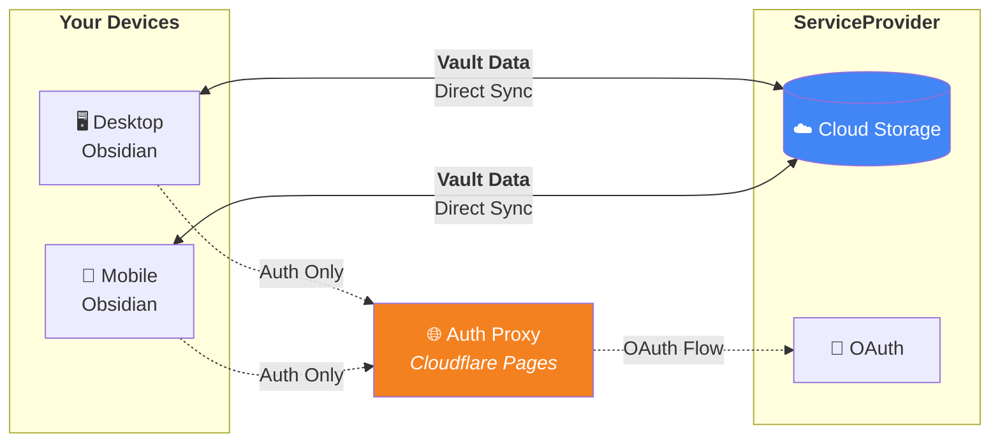
```mermaid
graph LR
    subgraph "<b>Your Devices</b>"
        A["🖥️ Desktop<br/>Obsidian"]
        B["📱 Mobile<br/>Obsidian"]
    end

    subgraph "<b>ServiceProvider</b>"
        C[("☁️ Cloud Storage")]
        D["🔐 OAuth"]
    end

    E["🌐 Auth Proxy<br/><i>Cloudflare Pages</i>"]

    A <--->|"<b>Vault Data</b><br/>Direct Sync"| C
    B <--->|"<b>Vault Data</b><br/>Direct Sync"| C
    A -.->|"Auth Only"| E
    B -.->|"Auth Only"| E
    E -.->|"OAuth Flow"| D

    style C fill:#4285F4,color:#fff
    style E fill:#F48120,color:#fff
```

> **Vault data is always transferred directly between your device and cloud storage.**
> The auth proxy is only used during the initial OAuth login and can be bypassed with your own Client ID.

---

## 🔧 Sync Engine Specifications

### Smart Sync Flow

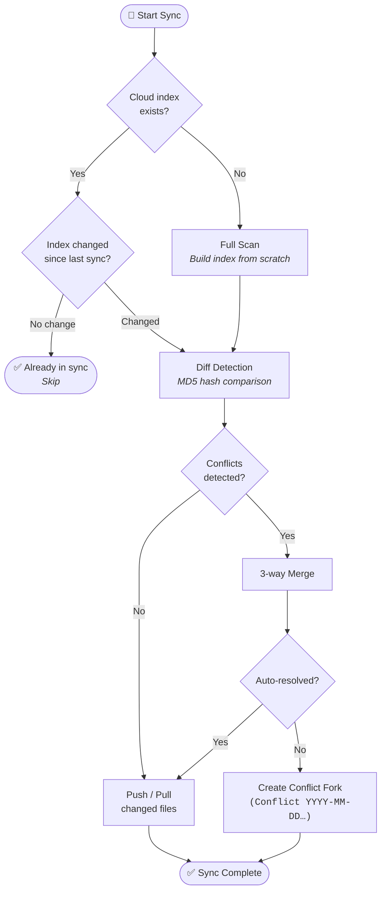
```mermaid
flowchart TD
    A(["🔄 Start Sync"]) --> B{"Cloud index<br/>exists?"}
    B -->|No| F["Full Scan<br/><i>Build index from scratch</i>"]
    B -->|Yes| C{"Index changed<br/>since last sync?"}
    C -->|No change| D(["✅ Already in sync<br/><i>Skip</i>"])
    C -->|Changed| E["Diff Detection<br/><i>MD5 hash comparison</i>"]
    F --> E
    E --> G{"Conflicts<br/>detected?"}
    G -->|No| H["Push / Pull<br/>changed files"]
    G -->|Yes| I["3-way Merge"]
    I --> J{"Auto-resolved?"}
    J -->|Yes| H
    J -->|No| K["Create Conflict Fork<br/><code>(Conflict YYYY-MM-DD…)</code>"]
    H --> L(["✅ Sync Complete"])
    K --> L
```

### 3-way Merge

When the same file is edited on multiple devices, Vault-Sync resolves conflicts using a three-way merge based on a common ancestor.

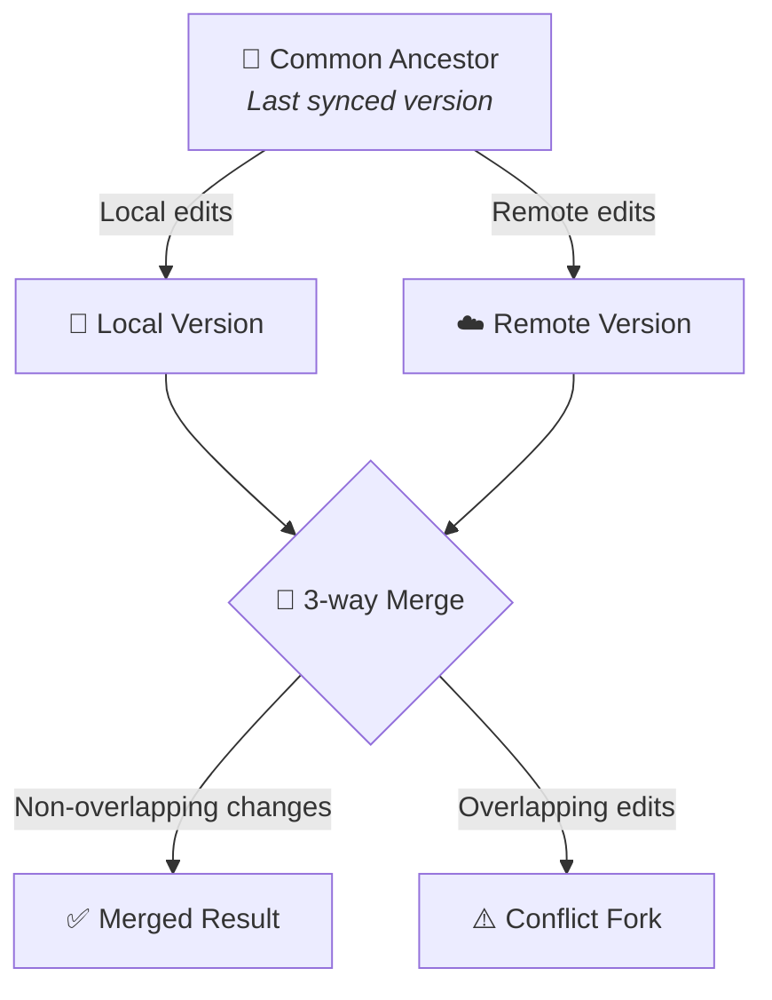
```mermaid
graph TD
    A["📄 Common Ancestor<br/><i>Last synced version</i>"]
    A -->|"Local edits"| B["📝 Local Version"]
    A -->|"Remote edits"| C["☁️ Remote Version"]
    B --> D{"🔀 3-way Merge"}
    C --> D
    D -->|"Non-overlapping changes"| E["✅ Merged Result"]
    D -->|"Overlapping edits"| F["⚠️ Conflict Fork"]
```

### Other Specifications

- **Conflict Resolution**: In addition to 3-way Merge, choose from "Smart Merge", "Force Local", "Force Remote", or "Always Fork" strategies. If a conflict cannot be auto-resolved, the local file is backed up as `(Conflict YYYY-MM-DDTHH-mm-ss)`.
- **Selective Sync**: Control synchronization of files within `.obsidian/` (plugins, themes, hotkeys, etc.) by category. Device-specific data like `workspace.json` and `cache/` are automatically excluded.
- **Device Communication**: Merge lock control between devices via `communication.json` prevents overwriting when the same file is edited simultaneously.
- **Atomic Updates**: Individual index entries are updated upon each file transfer. The index is Gzip-compressed for efficient synchronization.

---

## 🔒 Privacy and Security

- **Direct Communication**:
    - All vault data is synchronized directly between your device and cloud storage. No vault content passes through the authentication proxy or any third-party server.
- **Authentication Proxy**:
    - By default, the plugin uses an authentication proxy hosted on [Cloudflare Pages](https://www.cloudflare.com/) to facilitate the OAuth login flow. This proxy handles OAuth authorization codes and tokens **transiently** (in-memory only, never persisted). You can bypass this proxy by configuring your own Client ID / Client Secret. See the [Privacy Policy](https://obsidian-vault-sync.pages.dev/privacy/) for details.
- **Auth Protection**:
    - Sensitive information such as tokens and encryption secrets are stored via Obsidian's SecretStorage API, minimizing the presence of sensitive files within the vault. In environments where SecretStorage is unavailable, the plugin automatically falls back to local file storage encrypted with a device-specific key (AES-GCM) to maintain security.
- **Data Location**:
    - Synced data is stored exclusively in your own cloud storage space (in the root folder you specify).
- **File Encryption**:
    - By default, synced data (Markdown files, etc.) is uploaded to cloud storage in **plain text (without encryption)**. While protected by the cloud storage security model (HTTPS transfer, server-side encryption), data is readable on the server side. If End-to-End Encryption is required, install the [Vault-Sync E2EE Engine](https://github.com/c-ardinal/obsidian-vault-sync-e2ee-engine). See the section below for details.

---

## 🔑 End-to-End Encryption (E2EE)

Vault-Sync supports optional End-to-End Encryption through a separate, open-source encryption engine.

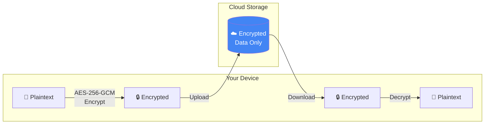
```mermaid
flowchart LR
    subgraph "Your Device"
        A["📄 Plaintext"]
        B["🔒 Encrypted"]
        D["🔒 Encrypted"]
        E["📄 Plaintext"]
    end

    subgraph "Cloud Storage"
        C[("☁️ Encrypted<br/>Data Only")]
    end

    A -->|"AES-256-GCM<br/>Encrypt"| B
    B -->|"Upload"| C
    C -->|"Download"| D
    D -->|"Decrypt"| E

    style C fill:#4285F4,color:#fff
```

When E2EE is enabled:

- All files are **encrypted on your device before upload** using AES-256-GCM
- Files are **decrypted locally after download** — your cloud provider never sees plaintext
- A `vault-lock.vault` file protects the master key (derived via PBKDF2 from your password)
- Smart sync features (3-way merge, conflict detection) work seamlessly with encrypted data
- Password can be optionally stored via Obsidian's SecretStorage for auto-unlock
- Password changes without re-encrypting data
- Master key can be exported as a Base64 string, enabling **recovery code generation** for password loss recovery
- Reduces peak memory for files above the configurable threshold with **streaming encryption for large files**

The E2EE Engine is provided as a standalone `e2ee-engine.js` file.
Place it in the Vault-Sync plugin directory (`.obsidian/plugins/obsidian-vault-sync/`). Vault-Sync will automatically detect and load the engine on startup, verifying its integrity via SHA-256 hash before activation.

For details, available commands, build instructions, and the encryption specification, see the **[Vault-Sync E2EE Engine repository](https://github.com/c-ardinal/obsidian-vault-sync-e2ee-engine)**.

---

## 🛠 Development and Build

For running in a development environment or building from source:

### Build

```bash
npm run build
```

Build results are output to the `dist/obsidian-vault-sync/` directory as follows.
When distributing, copy the contents of this folder to your plugins directory.

- `main.js`
- `manifest.json`
- `styles.css`

---

## ⚠️ Disclaimer

### Data Loss Risk

While this plugin automates synchronization, it does not completely eliminate the risk of data loss due to network errors or unforeseen conflicts. **The author shall not be held liable for any damages (including data loss or corruption of the Vault) arising from the use of this plugin.** Ensure you have a full backup before installing this plugin and continue to maintain regular backups thereafter.
See the [Terms of Service](https://obsidian-vault-sync.pages.dev/tos/) for details.

### Multi-User Usage

This plugin's sync/merge functionality is designed for **a single user synchronizing their edits across multiple devices**. **Synchronizing simultaneous edits by multiple users on the same vault** is not a supported use case.

---

## ❓ FAQ

**Q: The sync icon keeps spinning and doesn't stop.**
A: You might be syncing many files, or the network may be unstable.
Check the notification messages or enable logging in the settings for details.

**Q: I want to exclude specific folders or files from syncing.**
A: Add glob patterns to the "Exclude Files/Folders" setting.
For example, adding `secret/**` will exclude the `secret` folder and all files within it from synchronization.

**Q: On mobile, I'm not redirected back to the app after authentication.**
A: Browser security settings may prevent automatic redirection.
Once the authentication completion screen appears, manually switch back to the Obsidian app.
If authentication still doesn't complete, try a different Login Method (e.g., "Use Client ID / Secret") in the settings.

**Q: Sync was working before but suddenly stopped.**
A: Credentials may have expired. Re-configure authentication from the settings.

**Q: Does sync/merge work correctly with E2EE enabled?**
A: Yes. The E2EE Engine applies 3-way merge algorithms to encrypted data for conflict detection and resolution. Smart sync also works seamlessly with encrypted data.

## License

MIT License
