<p align="center">
  
</p>

<p align="center">
  <b>Cloud sync plugin for Obsidian</b>
</p>

<p align="center">
  <a href="README.md">🇺🇸 English</a> | <a href="README_ja.md">🇯🇵 日本語</a>
</p>

<p align="center">
  <a href="https://opensource.org/licenses/MIT"></a>
  <a href="https://github.com/c-ardinal/obsidian-vault-sync/releases"></a>
  <a href="https://github.com/c-ardinal/obsidian-vault-sync/actions/workflows/test.yml"></a>
  
</p>

---

A high-speed, intelligent cloud storage sync plugin for Obsidian.
Leveraging Google Drive, it provides robust data consistency and a fast synchronization experience across PC and mobile devices (iOS/Android).

### Architecture

```mermaid
graph LR
    subgraph "<b>Your Devices</b>"
        A["🖥️ Desktop<br/>Obsidian"]
        B["📱 Mobile<br/>Obsidian"]
    end

    subgraph "<b>Google</b>"
        C[("☁️ Google Drive")]
        D["🔐 Google OAuth"]
    end

    E["🌐 Auth Proxy<br/><i>Cloudflare Pages</i>"]

    A <--->|"<b>Vault Data</b><br/>Direct Sync"| C
    B <--->|"<b>Vault Data</b><br/>Direct Sync"| C
    A -.->|"Auth Only"| E
    B -.->|"Auth Only"| E
    E -.->|"OAuth Flow"| D

    style C fill:#4285F4,color:#fff
    style E fill:#F48120,color:#fff
```



> **Vault data is always transferred directly** between your device and Google Drive.
> The auth proxy is only used during the initial OAuth login (and can be bypassed with your own Client ID).

---

## ⚙️ Requirements

- **Obsidian**: v0.15.0 or higher
- **Google Account**: Required to access the Google Drive API
- **Network**: Internet connection (required during sync)
- **Google Cloud Project** _(optional)_: Only required if you choose to use your own Client ID / Client Secret instead of the default authentication proxy

---

## ✨ Key Features

- **Intelligent Sync (Index Shortcut)**: Shares a master index on the cloud. Skips the full scan if no changes are detected, saving battery and data usage.
- **Fast Difference Detection (MD5 Adoption)**: Even without an existing index, it matches file MD5 hashes. If they match, the local file is adopted instantly without a redundant download.
- **Smart Merge (3-way Merge)**: When multiple devices edit a file simultaneously, it performs an automatic merge based on a common ancestor. During conflicts, it is safely protected by lock control (`communication.json`).
- **Revision History & Diff Viewer**: Retrieves file revisions from Google Drive, allowing for diff visualization against the local version and restoration of past versions.
- **Mobile Optimized**: Built on the `fetch` API to run on both desktop and mobile. Features include auto-sync on edit-stop or save, and layout change triggers (e.g., when switching tabs).
- **Granular Sync Settings**: Selectively sync settings, plugins, themes, and hotkeys within `.obsidian`. Cache and temporary files are automatically excluded.
- **Secure Authentication & Storage**: OAuth2 authentication via the built-in authentication proxy (no setup required) or your own Client ID/Secret with PKCE. Credentials are separated from the main settings and saved using system-standard secure storage (Keychain/Credential Manager).
- **End-to-End Encryption (E2EE)**: Optional client-side encryption for your vault data. When enabled with the [E2EE Engine](https://github.com/c-ardinal/obsidian-vault-sync-e2ee-engine), all files are encrypted locally before upload and decrypted after download — your cloud provider never sees plaintext content.

|               Transfer Status               |                   Selective Sync                   |
| :-----------------------------------------: | :------------------------------------------------: |
|  |  |

---

## 📖 Usage

### Running Synchronization

- **Ribbon Icon**: Click the sync icon in the left toolbar to start a Smart Sync.
- **Command Palette**: Press `Ctrl+P` (or `Cmd+P`) and search for `VaultSync: Sync with Cloud`.
- **Auto-Sync**: Depending on your settings, sync will trigger on file save, when you stop editing, or at fixed intervals.

|             Sync Notifications              |                     Sync Triggers                      |
| :-----------------------------------------: | :----------------------------------------------------: |
|  |  |

### History and Restoration

- **File History**: Right-click a file and select "View History in Cloud (VaultSync)" to see diffs against past revisions.
- **Advanced Diff Viewer**: Provides powerful comparison tools including Unified/Split view toggle, inline character-level highlighting, jump navigation between changes (with looping), and adjustable context lines.
- **Full Scan**: If you are concerned about consistency, run `VaultSync: Audit & Fix Consistency (Full Scan)` from the command palette to perform a forced sync check.

|              Cloud History              |             Diff Viewer             |
| :-------------------------------------: | :---------------------------------: |
|  |  |

---

## 🔧 Sync Engine Specifications

### Smart Sync Flow

```mermaid
flowchart TD
    A(["🔄 Start Sync"]) --> B{"Cloud index<br/>exists?"}
    B -->|No| F["Full Scan<br/><i>Build index from scratch</i>"]
    B -->|Yes| C{"Index changed<br/>since last sync?"}
    C -->|No change| D(["✅ Already in sync<br/><i>Skip</i>"])
    C -->|Changed| E["Diff Detection<br/><i>MD5 hash comparison</i>"]
    F --> E
    E --> G{"Conflicts<br/>detected?"}
    G -->|No| H["Push / Pull<br/>changed files"]
    G -->|Yes| I["3-way Merge"]
    I --> J{"Auto-resolved?"}
    J -->|Yes| H
    J -->|No| K["Create Conflict Fork<br/><code>(Conflict YYYY-MM-DD…)</code>"]
    H --> L(["✅ Sync Complete"])
    K --> L
```



### 3-way Merge

When the same file is edited on multiple devices, VaultSync resolves conflicts using a three-way merge based on a common ancestor.

```mermaid
graph TD
    A["📄 Common Ancestor<br/><i>Last synced version</i>"]
    A -->|"Local edits"| B["📝 Local Version"]
    A -->|"Remote edits"| C["☁️ Remote Version"]
    B --> D{"🔀 3-way Merge"}
    C --> D
    D -->|"Non-overlapping changes"| E["✅ Merged Result"]
    D -->|"Overlapping edits"| F["⚠️ Conflict Fork"]
```



### Other Specifications

- **Conflict Resolution**: In addition to 3-way Merge, you can choose from "Smart Merge", "Force Local", "Force Remote", or "Always Fork" strategies. If a conflict cannot be resolved automatically, the local file is backed up as `(Conflict YYYY-MM-DDTHH-mm-ss)`.
- **Selective Sync**: You can control the synchronization of files within `.obsidian/` (plugins, themes, hotkeys, etc.) by category. Device-specific data like `workspace.json` and `cache/` are automatically excluded.
- **Device Communication**: Performs merge lock control between devices via `communication.json` to prevent overwriting when the same file is edited simultaneously.
- **Atomic Updates**: Updates individual index entries upon each file transfer. The index is Gzip-compressed for efficient synchronization.

---

## 🔒 Privacy and Security

- **Direct Communication**: All vault data is synchronized directly between your device and Google Drive. No vault content passes through the authentication proxy or any third-party server.
- **Authentication Proxy**: By default, the plugin uses an authentication proxy hosted on [Cloudflare Pages](https://www.cloudflare.com/) to facilitate the OAuth login flow. This proxy handles OAuth authorization codes and tokens **transiently** (in-memory only, never persisted). You can bypass this proxy by configuring your own Client ID / Client Secret. For details, see our [Privacy Policy](https://obsidian-vault-sync.pages.dev/privacy/).
- **Auth Protection**: Sensitive information such as tokens and encryption secrets are stored directly in the OS-standard secure storage (Keychain/Credential Manager) via Obsidian's Secret Storage API. This minimizes the presence of sensitive files within the Vault. In environments where Secret Storage is unavailable, the plugin automatically falls back to local file storage encrypted with a device-specific key (AES-GCM) to maintain high security.
- **Data Location**: Your synced data is stored exclusively in your own Google Drive storage (in the root folder you specify).
- **Important**: By default, synced data (Markdown files, etc.) is uploaded to Google Drive in **plain text (without encryption)**. While protected by Google Drive's security model (HTTPS transfer, server-side encryption), the data is readable on the server side. If you require End-to-End Encryption, please install the [VaultSync E2EE Engine](https://github.com/c-ardinal/obsidian-vault-sync-e2ee-engine) — see the section below for details.

---

## 🔑 End-to-End Encryption (E2EE)

VaultSync supports optional End-to-End Encryption through a separate, open-source encryption engine.

```mermaid
flowchart LR
    subgraph "Your Device"
        A["📄 Plaintext"]
        B["🔒 Encrypted"]
        D["🔒 Encrypted"]
        E["📄 Plaintext"]
    end

    subgraph "Google Drive"
        C[("☁️ Encrypted<br/>Data Only")]
    end

    A -->|"AES-256-GCM<br/>Encrypt"| B
    B -->|"Upload"| C
    C -->|"Download"| D
    D -->|"Decrypt"| E

    style C fill:#4285F4,color:#fff
```



When E2EE is enabled:

- All files are **encrypted on your device before upload** using AES-256-GCM
- Files are **decrypted locally after download** — your cloud provider never sees plaintext
- A `vault-lock.vault` file protects the master key (derived via PBKDF2 from your password)
- Smart sync features (3-way merge, conflict detection) work seamlessly with encrypted data
- Password can be optionally stored in OS-level secure storage for auto-unlock
- Enables password changes without re-encrypting data
- Exports the master key as a Base64 string, enabling **recovery code generation** for password loss recovery
- Reduces peak memory for files above the configurable threshold with **streaming encryption for large files**

### Setup

The E2EE Engine is provided as a standalone `e2ee-engine.js` file. Place it in the VaultSync plugin directory (`.obsidian/plugins/obsidian-vault-sync/`). VaultSync will automatically detect and load the engine on startup, verifying its integrity via SHA-256 hash before activation.

For details, available commands, build instructions, and the encryption specification, see the **[VaultSync E2EE Engine repository](https://github.com/c-ardinal/obsidian-vault-sync-e2ee-engine)**.

---

## 🚀 Setup Instructions

VaultSync offers three authentication methods. Choose the one that suits your needs.

### Method A: Default (Recommended)

The simplest way to get started. The plugin uses the developer-provided authentication proxy to handle the OAuth login — no Google Cloud setup required.

1. Open Obsidian Settings > "VaultSync".
2. Ensure the Login Method is set to **"Default"**.
3. Click the **"Login"** button.
4. A browser will open with the Google login screen.
5. After successful login, you will be automatically redirected back to Obsidian. Completion is confirmed when the success notification appears.
    - If you are not automatically redirected, please click the "Open Obsidian" button on the browser screen.
    - If it still doesn't return, please manually switch back to the Obsidian app.
6. Restart Obsidian after the success notification appears.

> **Note**: The authentication proxy only handles OAuth codes and tokens transiently (in-memory). No vault data passes through the proxy. See the [Privacy Policy](https://obsidian-vault-sync.pages.dev/privacy/) for details.

### Method B: Custom Auth Proxy

If you prefer to host your own authentication proxy server instead of using the default one.

1. Deploy an authentication proxy compatible with the VaultSync API (see the `www/functions/` directory for the reference implementation).
2. Open Obsidian Settings > "VaultSync".
3. Set the Login Method to **"Use Custom Auth Proxy"**.
4. Enter your proxy URL (must use HTTPS).
5. Click the **"Login"** button and complete the Google login flow.
6. Restart Obsidian after the success notification appears.

### Method C: Client ID / Secret

For full control, you can create your own Google Cloud Project and use your own OAuth credentials. In this mode, the callback page on Cloudflare Pages is used only as a redirect relay to pass the authorization code back to Obsidian via the `obsidian://` protocol. The plugin then exchanges the code for tokens directly with Google — no credentials or tokens pass through the proxy.

#### 1. Create a Google Cloud Project

1. Access the [Google Cloud Console](https://console.cloud.google.com/).
2. Create a new project.
3. Search for **Google Drive API** in "APIs & Services" > "Library" and click "Enable".

#### 2. Configure OAuth Consent Screen

1. **Create OAuth Consent Screen**:
    1. Go to "APIs & Services" > "OAuth Consent Screen" > "Summary" and click "Get Started" (or "Configure").
    2. Enter the required app information. Select "External" for User Type.
    3. Once completed, click "Create".
2. **Add Scopes**:
    1. Under "Data access", select "Add or remove scopes".
    2. Check `.../auth/drive.file` (See, edit, create, and delete only the specific Google Drive files you use with this app).
    3. Click "Update".
    4. Click "Save" at the bottom.
3. **Auth Period Persistence**:
   If the project remains in "Testing" state, re-authentication is required every 7 days.
   To avoid this, you need to publish the project, but this requires preparing a Terms of Service, Privacy Policy, etc. and passing Google's review.
   Please proceed carefully.

#### 3. Create Credentials (Client ID / Secret)

1. Go to "APIs & Services" > "Credentials" > "Create Credentials" > "OAuth Client ID".
2. Select **"Web Application"** as the Application type.
3. Under "Authorized redirect URIs", click "Add URI".
4. Enter `https://obsidian-vault-sync.pages.dev/api/auth/callback`.
    - This page acts as a redirect relay: it receives the authorization code from Google and forwards it to the Obsidian app via the `obsidian://` protocol. No tokens or credentials are stored.
    - You may also use your own server as the redirect URI.
5. Click "Create".
6. Copy the generated **Client ID** and **Client Secret**.
    - **Important**: The Client Secret is confidential. Never share it with others.

#### 4. Apply to Plugin

1. Open Obsidian Settings > "VaultSync".
2. Set the Login Method to **"Use Client ID / Secret"**.
3. Enter the Client ID and Client Secret, then click the **"Login"** button.
4. A browser will open with the Google login screen.
5. After successful login, you will be automatically redirected back to Obsidian. Completion is confirmed when the success notification appears.
    - If you are not automatically redirected, please click the "Open Obsidian" button on the browser screen.
    - If it still doesn't return, please manually switch back to the Obsidian app.
6. Restart Obsidian after the success notification appears.

---

## 🛠 Development and Build

For running in a development environment or building from source:

### Build

```bash
npm run build
```

The build results are output to the `dist/obsidian-vault-sync/` directory as follows.  
When distributing, copy the contents of this folder to your plugins directory.

- `main.js`
- `manifest.json`
- `styles.css`

---

## ⚠️ Disclaimer

While this plugin automates synchronization, it does not completely eliminate the risk of data loss due to network errors or unforeseen conflicts.
**The author shall not be held liable for any damages (including data loss or corruption of the Vault) arising from the use of this plugin.**
Please ensure you have a full backup before installing this plugin and continue to maintain regular backups thereafter.

---

## ❓ FAQ

**Q: The sync icon keeps spinning and doesn't stop.**  
A: You might be performing an initial sync with many files, or your network might be unstable.  
Check the notification messages or enable logging in the settings for details.

**Q: I want to exclude specific folders or files from syncing.**  
A: Add glob patterns to the "Exclude Files/Folders" setting.  
For example, adding `secret/**` will exclude the `secret` folder and all files within it from synchronization.

**Q: On the mobile version, I'm not redirected back to the app after authentication.**
A: Browser security settings may prevent automatic redirection.
Once the authentication completion screen appears, please manually switch back to the Obsidian app.
If authentication still doesn't complete, try using a different Login Method (e.g., "Use Client ID / Secret") in the settings.

## License

MIT License
