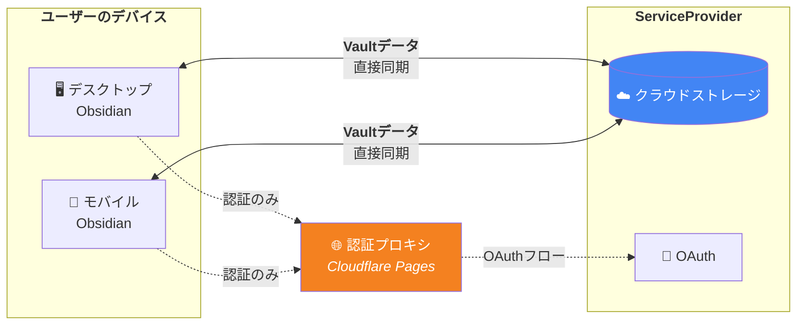
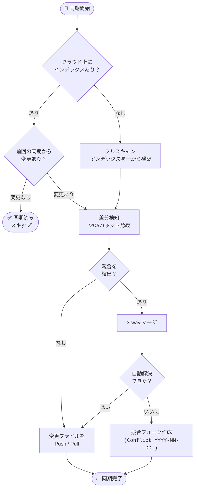
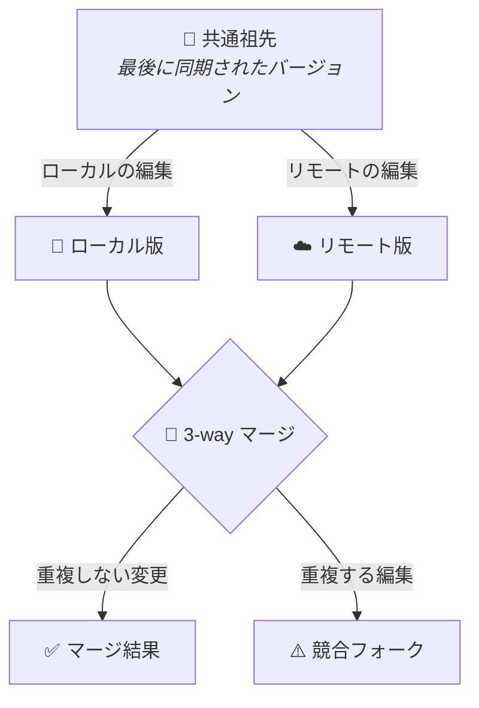
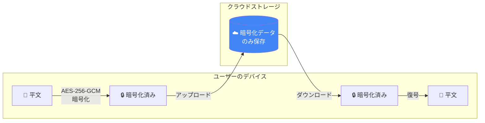

<p align="center">
  
</p>

<p align="center">
  <b>Cloud sync plugin for Obsidian</b>
</p>

<p align="center">
  <a href="README.md">🇺🇸 English</a> | <a href="README_ja.md">🇯🇵 日本語</a>
</p>

<p align="center">
  <a href="https://opensource.org/licenses/MIT"></a>
  <a href="https://github.com/c-ardinal/obsidian-vault-sync/releases"></a>
  <a href="https://github.com/c-ardinal/obsidian-vault-sync/actions/workflows/test.yml"></a>
  
</p>

Obsidian向けの高速・インテリジェントなクラウドストレージ同期プラグインです。
クラウドストレージを活用し、PCとモバイルデバイス（iOS/Android）間での強固なデータ一貫性と高速な同期体験を提供します。
サポートしているクラウドストレージは以下の通りであり、その他は順次対応予定です。

- [x] Google Drive

---

## ✨ 主な特徴

- **インテリジェント同期 (Index Shortcut)**:
    - MD5ハッシュ計算とObsidian標準のファイル変更検知機能を組み合わせ、Vault内の全ての変化を高速かつ効率的に検知。ドットファイルの変化も検知可能。
- **スマート・マージ (3-way Merge)**:
    - 複数デバイスで同時編集または同期タイミングの都合などの要因で競合が発生した場合でも、ロック制御により安全に保護しつつ可能な限り自動マージを行う。
- **履歴・差分表示 (Revision History)**:
    - クラウドストレージ上のファイルリビジョンを取得し、ローカルとの差分表示や過去バージョンの復元が可能。
- **モバイル最適化**:
    - 基盤に `fetch` APIを採用し、デスクトップ/モバイルの両方で動作。
    - 編集停止時や保存時の自動同期、レイアウト変更トリガー（タブ切り替え時）を搭載。
- **詳細な同期設定**:
    - `.obsidian` 内の設定、プラグイン、外観、ホットキーなどを個別に同期するか選択可能。キャッシュや一時ファイルは自動で除外される。
- **安全な認証 & 保存**:
    - 内蔵の認証プロキシ（設定不要）または独自の Client ID/Secret（PKCE対応）によるOAuth2認証。
    - 認証情報は設定ファイルから分離され、ObsidianのSecretStorage APIに安全に保存される。
- **バックグラウンド転送**:
    - 大容量ファイルはUIをブロックせずバックグラウンドでアップロード・ダウンロード。しきい値と同時接続数を設定可能。
- **エンドツーエンド暗号化 (E2EE)**:
    - [E2EE Engine](https://github.com/c-ardinal/obsidian-vault-sync-e2ee-engine) を別途導入することでVault内のデータを暗号化できる。アップロード前に暗号化・ダウンロード後に復号され、クラウド上に平文が残ることはない。

|               転送ステータス               |                   選択的同期                    |
| :----------------------------------------: | :---------------------------------------------: |
|  |  |

---

## 📖 使い方

### 同期の実行

- **手動同期**:
    - **リボンアイコン**:
        - 画面左側のツールバーにある同期アイコンをクリックすると、スマート同期が開始される。
    - **コマンドパレット**:
        - `Ctrl+P` (または `Cmd+P`) を押し、`Vault-Sync: Sync with Cloud` を選択する。
- **自動同期**:
    - 設定により、ファイル保存時や編集の停止時、一定時間ごとに自動で同期が行われる。

|             同期通知              |                 同期トリガー設定                  |
| :-------------------------------: | :-----------------------------------------------: |
|  |  |

### 履歴と復元

- **ファイル履歴**:
    - ファイルを右クリックし、「クラウドの変更履歴を表示 (Vault-Sync)」を選択すると、クラウドストレージ上の過去リビジョンとの比較が可能。
- **高機能diffビューア**:
    - Unified/左右分割表示の切り替え、行内差分のハイライト・差分箇所へのジャンプ機能（ループ対応）・表示コンテキスト行数の動的調整など、強力な比較機能を提供する。
- **フルスキャン**:
    - 整合性に不安がある場合、コマンドパレットから `Vault-Sync: Audit & Fix Consistency (Full Scan)` を実行して強制的に同期状態をチェックできる。

|              クラウド履歴              |             Diffビューア             |
| :------------------------------------: | :----------------------------------: |
|  |  |

---

## 📦 インストール

### コミュニティプラグイン (推奨)

1. Obsidianの設定 > コミュニティプラグインを開く。
2. コミュニティプラグインの「閲覧」をクリックする。
3. 検索窓に`c-ardinal/obsidian-vault-sync`と入力して、「インストール」をクリックする。
4. 設定 > コミュニティプラグインに戻り、「Vault-Sync」を有効化する。

### BRAT 経由

1. Obsidian のコミュニティプラグインから [BRAT](https://github.com/TfTHacker/obsidian42-brat) をインストールする。
2. BRAT の設定を開き、**「Add Beta plugin」** をクリックする。
3. `c-ardinal/obsidian-vault-sync` と入力し、`Latest version`を選択して、**「Add Plugin」** をクリックする。
4. 設定 > コミュニティプラグインから「Vault-Sync」を有効化する。

BRAT が自動的にアップデートを確認し、プラグインを最新の状態に保つ。

### 手動インストール

1. [最新リリース](https://github.com/c-ardinal/obsidian-vault-sync/releases/latest)から `main.js`、`manifest.json`、`styles.css` をダウンロードする。
2. Vault の `.obsidian/plugins/` ディレクトリに `obsidian-vault-sync` フォルダを作成する。
3. ダウンロードしたファイルをフォルダに配置する。
4. 設定 > コミュニティプラグインから「Vault-Sync」を有効化する。

---

## 🚀 ログイン手順

Vault-Sync には3つの認証方式がある。用途に合わせて選択する。

### 方法A: デフォルト（推奨）

最もシンプルな方法。開発者が提供する認証プロキシを使用してOAuthログインを行う。Google Cloud の設定は不要。

1. Obsidian の設定 > 「Vault-Sync」を開く。
2. ログイン方式が **「デフォルト」** になっていることを確認する。
3. **「ログイン」** ボタンを押す。
4. ブラウザが起動し、Googleのログイン画面が表示される。
5. ログインに成功すると自動的にObsidianへ戻る。認証成功を知らせる通知が表示されれば完了。
    - 自動的にObsidianに戻らない場合は、ブラウザ画面に表示される「Open Obsidian」ボタンを押す。
    - ボタンを押しても戻らない場合は手動でObsidianアプリに切り替える。
6. ログイン成功の通知が表示されたらObsidianを再起動する。

> **補足**: 認証プロキシはOAuth認可コードとトークンを一時的（メモリ上のみ）に処理するが、処理完了後は破棄する。Vault内のデータがプロキシを経由することはない。詳細は[プライバシーポリシー](https://obsidian-vault-sync.pages.dev/privacy/)を参照。

### 方法B: カスタム認証プロキシ

デフォルトの認証プロキシの代わりに、自前の認証プロキシサーバーを使用する場合の方法。

1. Vault-Sync API互換の認証プロキシをデプロイする（リファレンス実装は `www/functions/` ディレクトリを参照）。
2. Obsidian の設定 > 「Vault-Sync」を開く。
3. ログイン方式を **「他の認証プロキシを使用」** に変更する。
4. プロキシのURL（HTTPS必須）を入力する。
5. **「ログイン」** ボタンを押し、Googleのログインフローを完了する。
6. ログイン成功の通知が表示されたらObsidianを再起動する。

### 方法C: Client ID / Secret

完全なコントロールを必要とする場合、自分のGoogle Cloud Projectを作成し、独自のOAuth認証情報を使用できる。この方式では、Cloudflare Pages上のコールバックページは認証コードを `obsidian://` プロトコル経由でObsidianに転送するリダイレクトリレーとしてのみ使用される。トークン交換はプラグインがGoogleと直接行い、認証情報やトークンがプロキシを経由することはない。

#### 1. Google Cloud Project の作成

1. [Google Cloud Console](https://console.cloud.google.com/) にアクセスする。
2. 新しいプロジェクトを作成する。
3. 「APIとサービス」 > 「ライブラリ」から **Google Drive API** を検索し、「有効にする」を押す。

#### 2. OAuth 同意画面の設定

1. **OAuth 同意画面の作成**:
    1. 「APIとサービス」 > 「OAuth 同意画面」 > 「概要」から「開始」を押す。
    2. アプリ情報を入力する。User Type は「外部」を選択する。
    3. 全て記入したら「作成」を押す。
2. **スコープの追加**:
    1. 「データアクセス」から「スコープを追加または削除」を選択する。
    2. `.../auth/drive.file` （このアプリで使用する Google ドライブ上の特定のファイルのみの参照、編集、作成、削除）にチェックを入れる。
    3. 「更新」を押す。
    4. 画面下部の「Save」を押す。
3. **認証期間の永続化**:
   プロジェクトの状態が「テスト状態」のままだと7日ごとに再ログインが必要になる。
   再ログイン不要で利用し続けるにはプロジェクトを「公開状態」にする必要があるが、利用規約・プライバシーポリシー等を用意した上でGoogleの審査を合格する必要がある。慎重に対応すること。

#### 3. 認証情報 (Client ID / Secret) の作成

1. 「APIとサービス」 > 「認証情報」 > 「認証情報を作成」 > 「OAuth クライアント ID」を選択する。
2. アプリケーションの種類として **「ウェブ アプリケーション」** を選択する。
3. 「承認済みのリダイレクト URI」から「URIを追加」を押す。
4. `https://obsidian-vault-sync.pages.dev/api/auth/callback` と入力する。
    - これはGoogleからの認証コードを受け取り、`obsidian://` プロトコルでObsidianアプリに転送するリダイレクトリレーである。トークンや認証情報が上記URLのサーバに保存されることはない。
5. 「作成」を押す。
6. 生成された **クライアント ID** と **クライアント シークレット** をコピーする。
    - **重要**: クライアントシークレットは機密情報である。他人には絶対に教えないこと。

#### 4. プラグインへの反映

1. Obsidian の設定 > 「Vault-Sync」を開く。
2. ログイン方式を **「Client ID / Secret を使用」** に変更する。
3. IDとシークレットを入力し、**「ログイン」** ボタンを押す。
4. ブラウザが起動し、Googleのログイン画面が表示される。
5. ログインに成功すると自動的にObsidianへ戻る。認証成功を知らせる通知が表示されれば完了。
    - 自動的にObsidianに戻らない場合は、ブラウザ画面に表示される「Open Obsidian」ボタンを押す。
    - ボタンを押しても戻らない場合は手動でObsidianアプリに切り替える。
6. ログイン成功の通知が表示されたらObsidianを再起動する。

---

## 📒アーキテクチャ



> **Vaultデータは常にデバイスとクラウドストレージ間で直接転送される。**
> 認証プロキシはOAuthログイン時にのみ使用され、独自のClient IDを使えばバイパスも可能。

---

## 🔧 同期エンジンの仕様

### スマート同期フロー



### 3-way マージ

同じファイルが複数デバイスで編集された場合、共通の祖先を基に三方向マージで競合を解決する。



### その他の仕様

- **競合解決戦略**: 3-way Mergeによる自動解決に加え、「スマートマージ」「ローカル優先」「リモート優先」「レプリカ作成」の戦略を選択可能。自動解決できない場合はローカルファイルを `(Conflict YYYY-MM-DDTHH-mm-ss)` として退避。
- **選択的同期**: `.obsidian/` 内のファイル（プラグイン、テーマ、ホットキー等）をカテゴリ別に同期制御可能。`workspace.json` や `cache/` など、デバイス固有のデータは自動的に除外される。
- **デバイス間通信**: `communication.json` を通じてデバイス間でのマージロック制御を行い、同時に同じファイルを編集した際の上書きを防止する。
- **アトミック更新**: 各ファイル転送完了ごとに個別のインデックスエントリを更新。インデックスはGzip圧縮され、効率的に同期される。

---

## 🔒 プライバシーとセキュリティ

- **直接通信**:
    - すべてのVaultデータはデバイスとクラウドストレージ間で直接同期される。認証プロキシやサードパーティサーバーを経由してVaultの内容が送信されることはない。
- **認証プロキシ**:
    - デフォルトでは、本プラグインは [Cloudflare Pages](https://www.cloudflare.com/) 上にホストされた認証プロキシを使用してOAuthログインフローを仲介する。このプロキシはOAuth認可コードとトークンを**一時的に**（メモリ上のみで永続化せず）処理する。独自の Client ID / Client Secret を設定することで、このプロキシの使用を回避できる。詳細は[プライバシーポリシー](https://obsidian-vault-sync.pages.dev/privacy/)を参照。
- **認証保護**:
    - トークンや暗号化シークレットなどの機密情報は、ObsidianのSecretStorage APIを介して保管される。これにより、Vault内に機密情報を含むファイルが残ることを最小限に抑える。なお、SecretStorageが利用できない環境では、自動的にデバイス固有の秘密鍵（AES-GCM）で暗号化されたローカルファイル保存へとフォールバックし、安全性を維持する。
- **データの所在**:
    - 同期されたデータは、ユーザ自身のクラウドストレージ領域（指定したルートフォルダ）のみに保存される。
- **ファイル暗号化**:
    - デフォルトでは、同期されるデータ（Markdownファイル等）はクラウドストレージへ**平文（暗号化なし）でアップロードされる**。クラウドストレージ自体のセキュリティモデル（HTTPS転送、サーバー側暗号化）で保護されるが、サーバー側でデータを読み取ることが可能。エンドツーエンド暗号化が必要な場合は、[Vault-Sync E2EE Engine](https://github.com/c-ardinal/obsidian-vault-sync-e2ee-engine) を導入すること。詳細は下記セクションを参照。

---

## 🔑 エンドツーエンド暗号化 (E2EE)

Vault-Sync は、別途公開されているオープンソースの暗号化エンジンを通じて、オプションでエンドツーエンド暗号化に対応している。



E2EE を有効にすると:

- すべてのファイルが **アップロード前にデバイス上で AES-256-GCM により暗号化** される
- ダウンロード後は **ローカルで復号** され、クラウドストレージ側が平文を見ることはない
- `vault-lock.vault` ファイルがマスターキーを保護する（パスワードから PBKDF2 で導出）
- スマート同期機能（3-way マージ、競合検出）は暗号化データでもシームレスに動作する
- パスワードを ObsidianのSecretStorageに保存し、自動ロック解除も可能
- データの再暗号化なしにパスワードを変更可能
- マスターキーを Base64 文字列としてエクスポートし、パスワード紛失時の復旧に使用する**リカバリーコードを生成可能**
- 設定閾値以上のファイルでピークメモリを削減しつつ、**大容量ファイルのストリーミング暗号化** を実現する

E2EE Engineは単体の `e2ee-engine.js` ファイルとして提供される。
Vault-Syncのプラグインディレクトリ（`.obsidian/plugins/obsidian-vault-sync/`）に配置するだけで、Vault-Syncが起動時に自動検出し、SHA-256ハッシュで整合性を検証した上で読み込む。

詳細、利用可能なコマンド、ビルド手順、暗号化仕様については **[Vault-Sync E2EE Engine リポジトリ](https://github.com/c-ardinal/obsidian-vault-sync-e2ee-engine)** を参照。

---

## 🛠 開発とビルド

開発環境で実行、またはソースからビルドする場合：

### ビルド

```bash
npm run build
```

ビルド結果は `dist/obsidian-vault-sync/` ディレクトリ配下に以下の形式で出力される。
配布時はこのフォルダの中身をプラグインフォルダへコピーする。

- `main.js`
- `manifest.json`
- `styles.css`

---

## ⚠️ 免責事項

### データ損失リスク

本プラグインはデータの同期を自動化するが、ネットワークエラーや予期せぬ競合によりデータが損失するリスクを完全に排除するものではない。**本プラグインの使用によって生じたいかなる損害（データ消失、Vaultの破壊など）についても、作者は一切の責任を負わない。** 重要なデータについては、本プラグインの導入前に必ずバックアップを取得し、その後も定期的なバックアップを継続すること。
詳細は[利用規約](https://obsidian-vault-sync.pages.dev/tos/)を参照。

### 複数ユーザでの利用

本プラグインの同期/マージ機能は**1人のユーザが編集した内容を、複数のデバイス間で同期すること**を想定して開発されている。**複数ユーザが同じVaultで同時編集した内容を同期する** といった使い方は想定していない。予め了承のこと。

---

## ❓ よくある質問 (FAQ)

**Q: 同期アイコンが回転したまま止まらない。**
A: 大量のファイルを同期しているか、ネットワークが不安定な可能性がある。
通知メッセージを詳細にするか、設定画面からログ出力を有効にして詳細を確認すること。

**Q: 特定のフォルダ・ファイルを同期したくない。**
A: 設定の「除外ファイル/フォルダ」に、globパターンで除外したいフォルダやファイル名を追加する。
例えば`secret/**`と設定すると、`secret`フォルダおよびこのフォルダ配下のファイルが同期されなくなる。

**Q: モバイル版で認証後にアプリに戻らない。**
A: ブラウザのセキュリティ設定により自動で戻れない場合がある。
認証完了画面が表示されたら、手動でObsidianアプリに切り替える。
それでも認証が完了しない場合は、設定画面からログイン方式を変更（例：「Client ID / Secret を使用」）して試す。

**Q: いつもは変更内容が同期されるのに、ある時から同期されなくなった。**
A: 認証情報が失効している可能性がある。設定画面から認証情報を再設定すること。

**Q: E2EEを有効にした場合、同期/マージ機能は正常に動作するか？**
A: 正常に動作する。E2EE Engineは、暗号化されたデータに対して3-wayマージアルゴリズムを適用し、競合を検出・解決する。スマート同期機能も暗号化データに対してシームレスに動作する。

## ライセンス

MIT License
