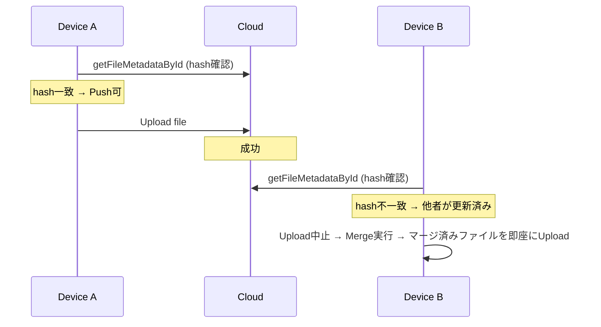
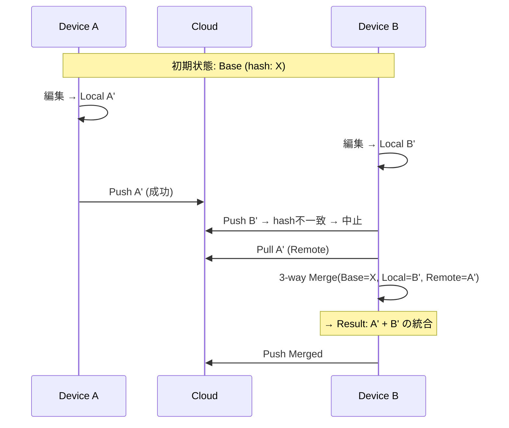
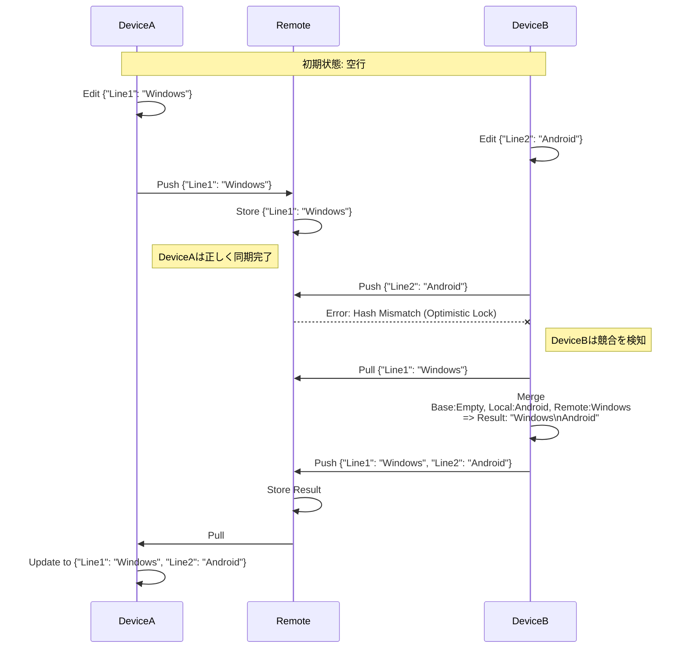

# 競合解決仕様

**親ドキュメント**: [仕様書](../specification.md)

---

## 1. 競合解決戦略

設定 `conflictResolutionStrategy` により選択可能。

| 戦略           | 動作                                                      |
| :------------- | :-------------------------------------------------------- |
| `smart-merge`  | 3-wayマージで自動解決を試行。失敗時はConflictファイル作成 |
| `force-local`  | ローカルを優先（リモートを上書き）                        |
| `force-remote` | リモートを優先（ローカルを上書き）                        |
| `always-fork`  | 常にConflictファイルを作成（マージしない）                |

以下、デフォルトの `smart-merge` 戦略を中心に記述する。

## 2. 競合検知タイミング

### 2.1 Push時検知 (C1)

`smartPush` 中、アップロード直前にリモートハッシュを検証（楽観的ロック）。

- リモートハッシュがローカルのインデックス記録と不一致 → 他デバイスが先に更新
- アップロードを中止し、`pullFileSafely` を呼び出してマージを試行
- **マージ成功後、同一サイクル内でマージ済みファイルを即座にアップロードする**（Deadlock Breaking Immediate Upload）。これにより、インデックスとファイル本体の不整合を防止する

### 2.2 Pull時検知 (C2)

`smartPull` 実行時、リモートが更新されているがローカルにも未送信の変更がある場合。

- `lastAction: push` または `merge` のファイルでリモートハッシュが変化 → 競合
- マージを試行

### 2.3 Changes API反映時検知 (C3)

自身のPushがChanges APIで返された時、ハッシュが一致すれば `lastAction: pull` に正常遷移。不一致なら他デバイスの更新があったためC2に遷移。

### 2.4 マージロック競合 (C4)

他端末が `communication.json` でロックを保持中 → 待機またはリトライ。

### 2.5 二重競合 (C5)

マージ成功後のPush前にリモートがさらに更新された場合 → 再度マージを実行。

### 2.6 バイナリ競合 (C6)

画像等のバイナリファイルは3-wayマージ不可。即座にConflictファイル（`Filename (Conflict YYYY-MM-DD).ext`）を作成しリモート版をPull。

### 2.7 編集vs削除衝突 (C7)

一方が編集、他方が削除した場合、編集が優先される（削除後に編集されたファイルは再アップロード）。

## 3. 楽観的ロック (Optimistic Locking)

Push時の競合チェック。



**制約**: チェックとPushが非原子的なため、数秒以内の同時Pushでは検知できない場合がある。

## 4. 3-way マージ

### 4.1 マージエンジン

- **ライブラリ**: `diff-match-patch` (Google)
- **モード**: 行ベースエンコーディング（行を文字に変換してDMP処理）
- **前処理**: 全入力（Base/Local/Remote）の改行コードをLF (`\n`) に正規化
- **パラメータ**:
    - `Match_Threshold`: 0.5（半分以上の文脈一致で位置特定）
    - `Match_Distance`: 250（パッチの期待位置からこの行数以上ズレたら失敗）
    - `Patch_Margin`: 動的（4 → 2 → 1 のリトライ戦略）
    - `Added-Line Protection`: 有効
    - `Intra-line Merge`: 無効（将来の拡張課題）

### 4.2 マージフロー



### 4.3 マージ動作の具体例



### 4.4 Base（共通祖先）の決定

マージの正確性はBaseの正確な特定に依存する。

#### デュアルインデックスアーキテクチャ

同期状態を2つのインデックスで管理し、デバイスごとの確定的なBase特定を実現する。

| ファイル           | 役割                                                 | 同期           |
| :----------------- | :--------------------------------------------------- | :------------- |
| `sync-index.json`  | クラウド上の最新状態（正解）のみを管理               | 共有           |
| `local-index.json` | このデバイスが前回どのリビジョンまで同期したかを管理 | **同期対象外** |

`local-index.json` は `data/local/` に配置され、デバイス固有のファイルとして同期対象外となる。これにより、他デバイスの更新で「あるデバイスにとってのBaseリビジョン」が上書きされることを防ぎ、`local-index.json` のハッシュを確定的なBaseとして使用できる。オフライン作業後の同期やRevert後の再編集など、複雑なシナリオでの堅牢性が向上する。

#### ancestorHash

`sync-index.json` の各ファイルエントリに `ancestorHash` を保持。前回同期時のハッシュを記録し、Baseとして使用する。

#### ancestorHashライフサイクル

```
[初期状態]
  Local: A, Remote: A, ancestorHash: A

[編集後]
  Local: B, Remote: A, ancestorHash: A (変更なし)

[Push成功]
  Local: B, Remote: B, ancestorHash: B (★更新: Push成功時点のハッシュ)

[競合発生・マージ]
  Local: D(merged), Remote: C, ancestorHash: C (★リモートのハッシュを設定)
  ※ cloudIndex側: hash=C, ancestorHash=C（リモートの最新状態を記録）
  ※ localIndex側: hash=D(merged), ancestorHash=C（マージ元リモートを記録）

[マージ結果をPush成功]
  Local: D, Remote: D, ancestorHash: C (★Pushでは更新しない)

[他デバイスがPull → ancestorHash照合]
  ancestorHash=C がローカルハッシュと一致 → リモートは子孫 → Pull安全
```

**重要**:

- マージ直後、`ancestorHash` には**取り込んだリモート側のハッシュ**を設定する。これにより、他デバイスが次回Pullした際にリモートが自分の変更を包含した「子孫」であることを高速に検証できる（循環マージ防止）。
- Push時は `ancestorHash` を更新しない（上書きすると子孫関係が破壊される）。
- Push成功確認（Post-Push Pull でハッシュ一致）時にのみ `ancestorHash` を最新ハッシュに更新する。

#### findCommonAncestorHash（履歴検索フォールバック）

`ancestorHash` が存在しない場合（古いアダプター、インデックス移行時等）のフォールバック。Google Drive Revisions APIから履歴を取得し、正しい共通祖先を検索する。

- `localHash` と `remoteHash` の両方より前のリビジョンを探索
- どちらのハッシュとも異なるリビジョンを祖先として採用
- 有効な祖先が見つからない場合はマージを諦め、Conflictファイルを作成

### 4.5 Safety Guard（Pull時の子孫検証）

`lastAction` が `push` または `merge` のファイルに対してリモート更新が検出された場合、Safety Guardが発動する。

#### 検証フロー

1. **高速チェック（O(1)）**: リモートの `ancestorHash` と自端末の `localBase.hash` を比較
    - **一致** → リモートは自端末の変更を含む子孫 → **安全にPull可能**
    - **不一致** → リモートが自端末の変更を無視している可能性 → **マージを強制**
2. **フォールバック**: `ancestorHash` が存在しない場合、`findCommonAncestorHash` で履歴検索に回る

#### 循環マージ防止

Device Aがマージ結果をPushした場合、そのインデックスの `ancestorHash` にはDevice Bの変更ハッシュが記録される。Device BがPullすると、Safety Guardは `ancestorHash` と自分の `localBase.hash` が一致することを確認し、マージ済みの結果を安全にPullする。これによりマージ→Pull→再マージの無限ループを防止する。

### 4.6 マージ品質保護

| 機構                           | 内容                                                         |
| :----------------------------- | :----------------------------------------------------------- |
| **Added-Line Protection**      | Localで追加された行がマージ結果で消失した場合、マージを拒否  |
| **Mass Deletion Guard**        | 一方が全消去・過度な一括削除を検知した場合にマージ結果を拒否 |
| **Merge Result Validation**    | マージ結果がLocal/Remoteの行を不当に欠損していないか検証     |
| **Semantic Equivalence Check** | マージループ（ピンポン）検出のための意味的等価性チェック     |

### 4.7 動的パラメータ調整

`Patch_Margin` を段階的に縮小してリトライすることで、安全性と自動マージ成功率を両立。

1. `Patch_Margin=4` で試行（安全性重視）
2. 失敗時 → `Patch_Margin=2` で再試行
3. 失敗時 → `Patch_Margin=1` で再試行
4. 全失敗 → Conflictファイル作成

## 5. 分散マージロック

複数デバイスが同時にマージを行うことを防止し、マージ結果の一貫性を保証する。

### 5.1 ロック機構

`communication.json` を用いた分散ロック。

```json
{
    "mergeLock": {
        "holder": "<deviceId>",
        "expiresAt": "<timestamp>"
    }
}
```

### 5.2 フロー

1. **ロック取得**: 競合検知時、ロックが空（または期限切れ）であれば自デバイスIDを書き込んでPush
2. **ロック検証**: Push後にPullし、自分のIDが書き込まれているか確認（レースコンディション対策）
3. **マージ実行**: 検証成功 → マージ処理 → 結果Push → ロック解放
4. **ロック失敗**: 他デバイスがロック保持中 → 待機し、他デバイスのマージ結果をPull

### 5.3 ゾンビロック対策

`expiresAt` を過ぎたロックは他デバイスが強制無効化（奪取）可能。

## 6. Conflictファイル

マージ不可能な場合のフォールバック。

- ローカルファイルを `Filename (Conflict YYYY-MM-DD).ext` にリネーム
- リモート版を元のファイル名でダウンロード
- ユーザーが手動で内容を統合する

## 7. 既知の限界事項

- **行内マージ非対応**: 同一行への異なる編集は、オフセットが異なっていてもコンフリクトとなる
- **移動追跡不能**: 行・段落の移動はdelete+insertとして処理され、コンフリクトになりやすい
- **Push競合の非原子性**: チェックとPushの間に他デバイスが更新する極小のタイミングウィンドウが存在する
- **DMPの強引なマージ**: 文脈が極端に短い場合、パッチが「成功」と誤判定されることがある
