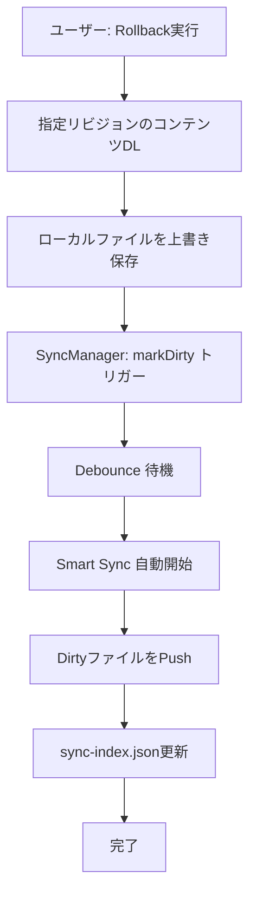

# 履歴機能仕様

**親ドキュメント**: [仕様書](../specification.md)

---

## 1. 概要

Google Driveのリビジョン管理機能を活用し、ファイルの変更履歴確認・差分表示・ロールバックを提供する。CloudAdapterの抽象化により、将来的に他ストレージへの拡張も可能。

## 2. 機能一覧

| 機能               | 説明                                                   |
| :----------------- | :----------------------------------------------------- |
| **履歴一覧**       | ファイルの変更履歴（日時・更新者・サイズ）を時系列表示 |
| **差分確認**       | 過去バージョンと現在バージョンの行単位Diff表示         |
| **ロールバック**   | 任意の過去バージョンにファイルを復元                   |
| **リビジョン保護** | `keepForever` フラグで自動削除を防止（Google Drive）   |

## 3. アダプターインターフェース

```typescript
// CloudAdapter に含まれる履歴関連メンバー
readonly supportsHistory: boolean;
listRevisions?(path: string): Promise<FileRevision[]>;
getRevisionContent?(path: string, revisionId: string): Promise<ArrayBuffer>;
setRevisionKeepForever?(path: string, revisionId: string, keepForever: boolean): Promise<void>;
deleteRevision?(path: string, revisionId: string): Promise<void>;

interface FileRevision {
    id: string;
    modifiedTime: number;  // Unix timestamp
    size: number;
    author?: string;
    keepForever?: boolean;
    hash?: string;         // MD5等の整合性検証用ハッシュ
}
```

## 4. Google Drive API マッピング

| 機能           | API              | 備考                                                                   |
| :------------- | :--------------- | :--------------------------------------------------------------------- |
| 履歴一覧       | `revisions.list` | `fields=revisions(id,modifiedTime,keepForever,size,lastModifyingUser)` |
| コンテンツ取得 | `revisions.get`  | `alt=media` でダウンロード                                             |
| ロールバック   | `files.update`   | 過去コンテンツを現在版として新規アップロード（履歴に残る）             |

## 5. ロールバックと同期の統合

ロールバックはSmart Syncフローと統合される。直接クラウドにアップロードせず、ローカルファイルを更新して変更検知フローに乗せる。



## 6. UI/UX

### 6.1 履歴リスト

- 対象ファイルを右クリック → "View History on Cloud Storage"
- `HistoryModal` でリビジョン一覧を非同期ロード

### 6.2 差分表示 (Diff View)

- リビジョン選択で左側（過去版）/右側（現在版）のDiff View表示
- 行単位の追加・削除・変更をハイライト
- **制限**: 2MBを超えるファイルはDiff表示不可（ダウンロードのみ）

### 6.3 復元アクション

- "Restore this version" ボタン → 確認ダイアログ → 実行

## 7. 制約・考慮事項

| 項目         | 内容                                                                                                |
| :----------- | :-------------------------------------------------------------------------------------------------- |
| **通信量**   | 差分確認時に過去ファイルをフルDL。セッション内キャッシュ（TTL: 24時間、終了時自動削除）で軽減       |
| **保存期間** | Google Driveは古いリビジョンを自動統合・削除（通常30日or 100版）                                    |
| **容量**     | `keepForever: true` はユーザーのストレージQuotaを消費                                               |
| **パス検証** | `listRevisions` 等のAPI呼び出し時にパストラバーサル防止の検証を実施                                 |
| **整合性**   | ダウンロード時にメタデータのハッシュとコンテンツのハッシュを照合し、破損・改竄を検知                |
| **監査ログ** | ロールバック等の重要操作は `[History] Rollback executed: File={path}, Revision={id}` 形式でログ記録 |
