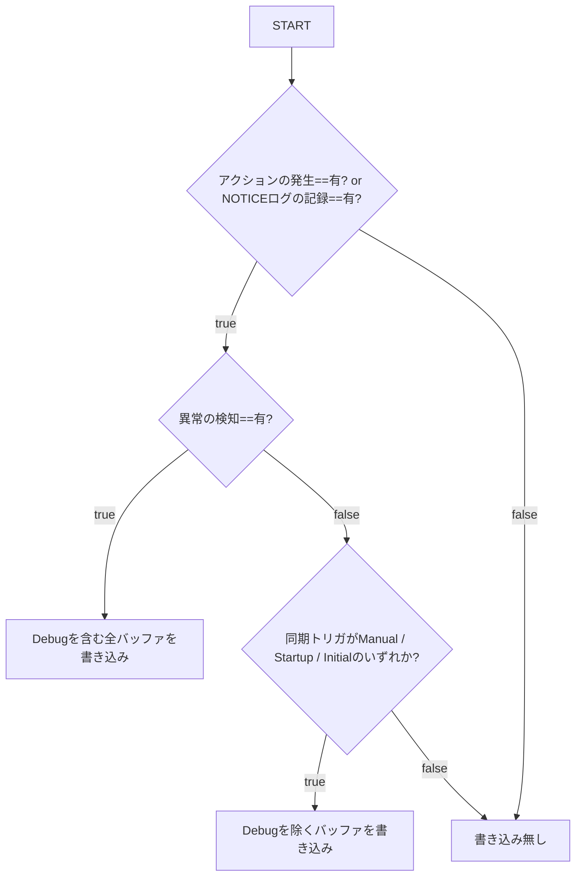

# ログ出力仕様

**親ドキュメント**: [仕様書](../specification.md)

---

## 1. 目的

同期処理の透明性を確保しつつ、特にモバイル端末や低速なストレージ環境において、頻繁なバックグラウンド同期によるログファイルの肥大化とI/O負荷を最小限に抑える。

## 2. アーキテクチャ

### 2.1 マスタースイッチ (`enableLogging`)

ログのファイル出力は、プラグイン設定の「詳細なログ出力を有効化 (`enableLogging`)」が ON の場合にのみ実行される。  
OFF の場合はコンソール出力のみとなるが、以下のレベルに限り、監査とトラブルシューティングのため常にファイルへ出力される。

- **`System`**: プラグインの起動、同期トリガーの検知、基本ステータス。
- **`Error`**: 同期失敗などの致命的なエラー。
- **`Notice`**: ユーザーの画面に実際に表示された通知内容の記録（監査用）。

### 2.2 コンポーネント構成

ログ管理機能を同期のメインロジックから分離し、専用の `SyncLogger` クラスで一元管理する。

- **関心の分離**: 同期エンジンは「何が起きたか」をログレベルと共に報告するだけで、実際にファイルへ書き出すかどうかの最終判断はロガーが行う。
- **バッファリング**: 同期サイクル（1回のPull/Push工程）ごとにログをメモリ上に保持し、サイクルの終了時に「出す価値があるか」を判定して一括処理する。

## 3. ログレベルの定義

| レベル           | 概要                             | 内容の例                                                                                  | 出力(非開発者モード時)               | 出力(開発者モード時) |
| :--------------- | :------------------------------- | :---------------------------------------------------------------------------------------- | :----------------------------------- | :------------------- |
| **System**       | 監査上の基本ステータス。         | - 起動情報 - 同期トリガーの検知 (`[Trigger]`) - Device ID - プラグインバージョン | 常に記録                             | 常に記録             |
| **Error / Warn** | 異常および警告。                 | - 通信エラー - 競合検出 - リトライ発生                                              | 常に記録                             | 常に記録             |
| **Notice**       | ユーザーへ通知されたメッセージ。 | - 実際に表示された通知内容 (`[Notice]`)                                                   | 常に記録                             | 常に記録             |
| **Info**         | 正常系の主要な進捗。             | - ファイル転送成功 - 同期開始/終了 - 表示されなかった通知 (`[Silent]`)              | 条件付き記録 (処理の重要度に依存) | 常に記録             |
| **Debug**        | 詳細な調査用情報。               | - リモートチェック (`Checking...`) - ハッシュ比較詳細 - No changes                  | 条件付き記録 (エラー発生時)       | 常に記録             |

## 4. 特殊モードの挙動

### 4.1 開発者モード (Developer Mode)

開発者モードが有効な場合、後述のバッファリングおよびフィルタリングロジックはすべてバイパスされる。
また、**「詳細なログ出力を有効化 (`enableLogging`)」の設定に関わらず、すべてのレベルのログがファイルへ記録される。**

1. **即時書き出し**: すべてのログレベル（Info/Debugを含む）は、同期サイクルの終了を待たず、発生した瞬間に即座にファイルへ記録される。
2. **完全記録**: エラーの有無やアクションの発生に関わらず、すべての `Debug` ログが破棄されずに記録される。

## 5. トリガー別の挙動と判定ロジック

バックグラウンド同期において、`Info` および `Debug` レベルのログは即座に書き込まれずバッファリングされる。

| トリガー                           | 出力モード(非開発者モード)             | 出力モード(開発者モード)               | 理由                                                           |
| :--------------------------------- | :------------------------------------- | :------------------------------------- | :------------------------------------------------------------- |
| **Manual / Startup / Initial**     | **常にバッファリング付き書き出し**     | **常に即時(非バッファリング)書き出し** | ユーザーが意図的に実行しているか、起動時の重要プロセスのため。 |
| **Timer / Save / Modify / Layout** | **条件付きバッファリング付き書き出し** | **常に即時(非バッファリング)書き出し** | 頻度が高く、何も変更がない場合が多いため。                     |

### 5.1 出力判定ロジック (Persistence Policy)

非開発者モードにおいて、同期サイクルの終了時に以下判定を実施し、該当する場合にログを書き込む。
（※ `System` / `Error` / `Notice` は判定に関わらず記録される）

- **アクションの発生**: ファイルのアップロード、ダウンロード、削除、移動、リネームが1件以上成功した。
- **NOTICEログの記録**: 実際にユーザーへ通知が表示された。
- **異常の検知**: 同一サイクル内で `Error` / `Warn` レベルのログが1件以上記録された。

## 6. 監査性能の担保

「ユーザーが何を見たか」を開発者が後から正確に知るため、トースト表示された通知（`Notice` レベル）は、たとえファイル転送やエラーがなくても必ずログに残る。  
これにより、「通知は出たのにログに記録がない」という状況を排除する。
