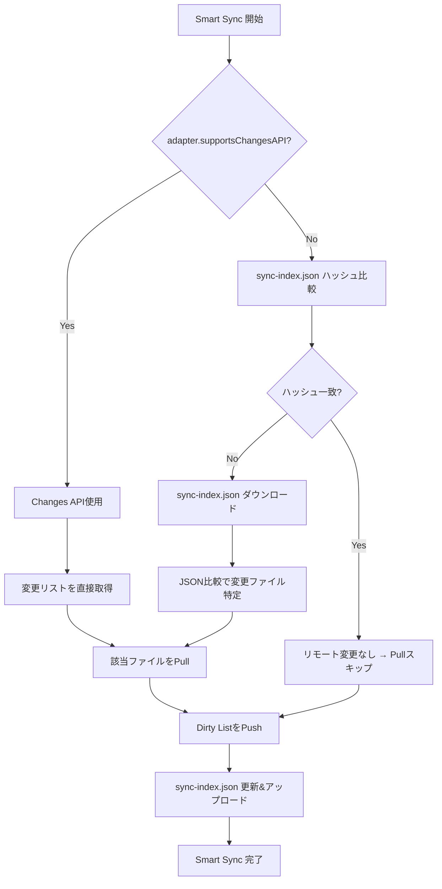
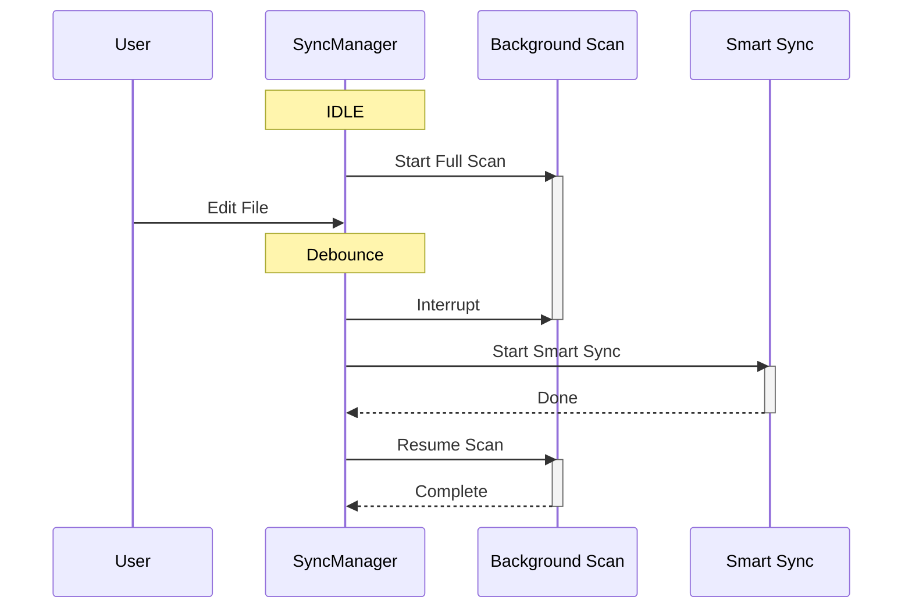

# 同期エンジン仕様

**親ドキュメント**: [仕様書](../specification.md)

---

## 1. 設計思想

特定のクラウドストレージAPIに依存しない汎用的な同期エンジン。`sync-index.json` をコア機構として高速差分検知を行い、Changes API等の拡張機能がある場合はさらに高速化する。

## 2. 同期モード

### 2.1 Smart Sync（高優先度）

ユーザー操作を起点とする高速同期。O(1)~O(変更数)で完了する。

#### 処理フロー



#### 高速化の仕組み

| 処理                     | API呼び出し             | 計算量    |
| :----------------------- | :---------------------- | :-------- |
| Changes API使用時        | `getChanges(token)` 1回 | O(変更数) |
| ハッシュ比較（変更なし） | `getFileInfo` 1回       | O(1)      |
| ハッシュ比較（変更あり） | + `download JSON` 1回   | O(変更数) |

### 2.2 Background Full Scan（低優先度）

アイドル時に実行される整合性チェック。ローカル/リモートの全ファイルを比較する。

- **トリガー**: Smart Sync完了後の一定時間（例: 30分後）
- **チャンク処理**: ファイルリストをチャンク単位で処理し、割り込みを常に監視
- **レジューム**: 割り込み時は進捗を保存し、Smart Sync完了後に再開

## 3. スケジューリングと割り込み (Preemption)

### 3.1 状態遷移

- `IDLE` → `SMART_SYNCING` → `IDLE`
- `IDLE` → `FULL_SCANNING` → `PAUSED` → `FULL_SCANNING` → `IDLE`

### 3.2 割り込みシーケンス



### 3.3 イベントキューイング

- 同期中の新イベントは1つに統合される（重複排除）
- `Silent=true`（バックグラウンド）と`Silent=false`（手動）が競合した場合、Non-silent（通知表示）が優先される
- 同期が完了した直後に統合されたイベントで再同期が開始される

## 4. 同期トリガー

| トリガー          | 条件             | 備考                                 |
| :---------------- | :--------------- | :----------------------------------- |
| **Startup Sync**  | 起動時           | `startupDelaySec` で猶予期間を設定可 |
| **Auto Sync**     | 定期インターバル | `autoSyncIntervalSec` で設定         |
| **File Modify**   | ファイル編集     | `onModifyDelaySec` でDebounce        |
| **Ctrl+S (Save)** | 手動保存         | `onSaveDelaySec` で遅延設定          |
| **Layout Change** | ファイル切替     | `onLayoutChangeDelaySec` で遅延設定  |

## 5. Index管理

### 5.1 sync-index.json（マスターインデックス）

クラウド上に保存され、全デバイス間で共有される。

```typescript
interface SyncIndexEntry {
    fileId: string;
    hash: string; // ファイルコンテンツのMD5ハッシュ
    mtime: number; // 最終更新時刻 (Unix timestamp)
    size: number;
    lastAction: "push" | "pull" | "merge";
    ancestorHash?: string; // 3-wayマージ用の祖先ハッシュ
}

type SyncIndex = Record<string, SyncIndexEntry>;
```

### 5.2 Index Shortcut

リモートの `sync-index.json` のハッシュ（またはETag）とローカルの記録が一致する場合、変更なしと見なしてPull全体をスキップする。

### 5.3 Adoption Logic

新規端末やインデックス消失時、ローカルファイルのMD5ハッシュをリモートと照合し、一致すればダウンロードをスキップしてインデックスに採用する。

## 6. Pull/Pushフロー

### 6.1 Pull（リモート → ローカル）

1. リモートの変更を検知（Changes API or Index比較）
2. 変更ファイルのダウンロード
3. ダウンロード前にローカルの変更有無をMD5で検証
4. 変更がある場合 → 競合解決（[競合解決仕様](conflict-resolution.md) 参照）
5. ローカルインデックス更新

### 6.2 Push（ローカル → リモート）

1. Dirty Listから変更ファイルを抽出
2. リモートフォルダの一括作成（深さ順、レースコンディション回避）
3. 並列アップロード（`concurrency` 設定に基づく）
4. アップロード直前にリモートハッシュを検証（楽観的ロック）
5. マスターインデックスをクラウドへ保存

## 7. エラーハンドリングとリトライ

### 7.1 ネットワークエラー・APIレート制限

`fetchWithAuth` メソッドにて Exponential Backoff を実装する。

| エラー                    | 対処                                                                                  |
| :------------------------ | :------------------------------------------------------------------------------------ |
| **429 Too Many Requests** | 指数関数的バックオフ（1秒→2秒→4秒 + ランダムジッター）で最大3回リトライ               |
| **5xx Server Error**      | 同上                                                                                  |
| **401 Unauthorized**      | トークンリフレッシュ後にリトライ（実装済み）                                          |
| **ネットワーク切断**      | `window.addEventListener('online', ...)` でオフライン時は待機し、復帰と同時にリトライ |

- モバイル環境ではバックグラウンド復帰時に `online` イベントが発火しない場合があるため、`window.onfocus` でのチェックも併用する
- Backoffによる定期的な再試行と組み合わせ、全プラットフォームでの確実な復帰を実現する

### 7.2 フォルダ作成の中断

`ensureFoldersExist` は複数フォルダを再帰的に作成するが、途中でエラーが発生した場合はフォルダ構造が不完全な状態となりうる。次回の同期で再作成されるため特別なロールバックは不要だが、エラーログを明確に残す。

## 8. パフォーマンスと制約

- **並列ワーカー**: `concurrency` 設定でアップロード/ダウンロード並列数を制御（デフォルト: 5）
- **フォルダバッチング**: 必要な全階層フォルダを深さ順に一括作成
- **Index Shortcut**: リモート未変更時はハッシュ比較のみでO(1)スキップ
- **巨大ファイルのメモリ制約**: `downloadFile` / `uploadFile` は `ArrayBuffer` でファイル全体をメモリに展開する。数百MBを超えるファイルではモバイル端末でOOMリスクあり。将来的に `ReadableStream` / `WritableStream` によるストリーム処理への移行を検討（Obsidian Mobile APIの制約確認が必要）

## 9. 内部状態構造

SyncManagerが保持する主要な内部状態。

```typescript
// 変更追跡
dirtyPaths: Set<string>;          // 変更されたファイルのパス集合

// インデックス
localIndex: SyncIndex;            // ローカルのsync-index.json
localIndexHash: string;           // ローカルsync-index.jsonのハッシュ（高速比較用）

// Background Full Scan用
fullScanProgress: {
  index: number;                  // 現在の処理位置
  total: number;                  // 全ファイル数
  lists: { local: string[]; remote: CloudFile[] };
} | null;

// Changes API用（対応アダプターのみ）
changesToken?: string;            // 次回getChanges()に渡すトークン

// 割り込み制御
isInterrupted: boolean;           // Full Scan中断フラグ
```

## 10. CloudAdapter インターフェース

```typescript
interface CloudAdapter {
    name: string;

    // === Feature Flags ===
    readonly supportsChangesAPI: boolean; // Changes API対応
    readonly supportsHash: boolean; // ファイルハッシュ対応
    readonly supportsHistory: boolean; // 履歴機能対応

    // 初期化（オプション: ルートフォルダ探索等の事前準備）
    initialize?(): Promise<void>;

    // 認証
    isAuthenticated(): boolean;
    getAuthUrl(): Promise<string>;
    handleCallback(url: string | URL): Promise<void>;
    logout(): Promise<void>;

    // ファイル操作（必須）
    getFileMetadata(path: string): Promise<CloudFile | null>;
    getFileMetadataById(fileId: string, knownPath?: string): Promise<CloudFile | null>;
    downloadFile(fileId: string): Promise<ArrayBuffer>;
    uploadFile(
        path: string,
        content: ArrayBuffer,
        mtime: number,
        existingFileId?: string,
    ): Promise<CloudFile>;
    deleteFile(fileId: string): Promise<void>;
    createFolder(path: string): Promise<string>;
    ensureFoldersExist(
        folderPaths: string[],
        onProgress?: (current: number, total: number, name: string) => void,
    ): Promise<void>;
    fileExistsById(fileId: string): Promise<boolean>;
    listFiles(folderId?: string): Promise<CloudFile[]>;

    // Changes API（supportsChangesAPI=true時のみ）
    getStartPageToken(): Promise<string>;
    getChanges(pageToken: string): Promise<CloudChanges>;

    // 履歴（supportsHistory=true時のみ）
    listRevisions?(path: string): Promise<FileRevision[]>;
    getRevisionContent?(path: string, revisionId: string): Promise<ArrayBuffer>;

    setLogger(logger: (msg: string) => void): void;
}
```

## 11. .obsidian 選択同期

`.obsidian` フォルダ内のファイルはカテゴリ別に同期可否を設定可能。

| カテゴリ               | 対象                                            | デフォルト |
| :--------------------- | :---------------------------------------------- | :--------- |
| 外観設定               | `themes/`, `snippets/`                          | ON         |
| コミュニティプラグイン | `plugins/`（本プラグイン除く）                  | ON         |
| コア設定               | `app.json`, `hotkeys.json`, `core-plugins.json` | ON         |
| ワークスペース         | `workspace.json`, `workspace-mobile.json`       | OFF        |

**常時除外**: `cache/`, `indexedDB/`, `backups/`

## 12. クラウドストレージ対応状況

| クラウド     | 基本同期 | Changes API                 | Hash比較     | 履歴   | 備考     |
| :----------- | :------- | :-------------------------- | :----------- | :----- | :------- |
| Google Drive | 実装済   | 対応 (高速Pull)             | MD5          | 対応   | フル機能 |
| Dropbox      | 将来     | 対応 (list_folder/continue) | content_hash | 対応   | -        |
| OneDrive     | 将来     | 対応 (delta API)            | quickXorHash | 対応   | -        |
| S3           | 将来     | 非対応                      | ETag         | 非対応 | 基本のみ |
| WebDAV       | 将来     | 非対応                      | 非対応       | 非対応 | 基本のみ |
