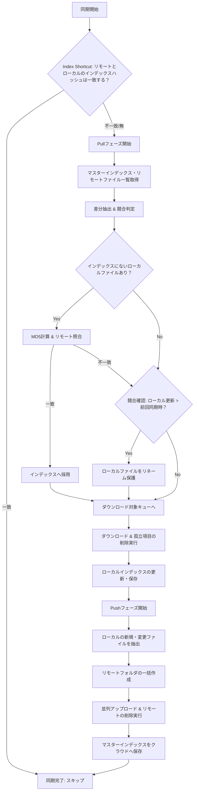

# Specification - Obsidian VaultSync Plugin

## 1. Goal Description

Obsidian向けのクラウドストレージ連携プラグイン。  
ローカルのObsidian VaultとGoogle Drive上のフォルダを同期させ、PC/Mobileを含む全プラットフォームでのデータ一貫性を保つ。

## 2. Core System

### 2.1 Architecture

- **SyncManager**: 同期のオーケストレーションを行うメインクラス。インデックスベースの高速差分検知と、インテリジェントな Pull/Push の分岐を管理する。
- **CloudAdapter Interface**: Google Drive API等の実装を抽象化。
- **GoogleDriveAdapter**: `fetch` APIを用いたREST Client実装。モバイル互換。
- **SecureStorage**: 設定ファイル（`data.json`）ではなく、暗号化/難読化されたバイナリファイル（`.sync-state`）に認証情報を保持。

### 2.2 Google Drive Structure

- **App Root**: `ObsidianVaultSync/`（設定、あるいはデフォルト）
- **Vault Root**: `ObsidianVaultSync/<VaultName>/`
- **Global Discovery**: `VaultName` と一致するフォルダをGoogle Drive内からグローバルに検索。見つかった場合は `App Root` 配下へ自動的に移動（Adoption）して統合する。

### 2.3 Index Management

- **Local Index**: `sync-index.json` にてメタデータを管理。
- **Master Index Sharing**: クラウド上にも `sync-index.json` を保存し、複数端末間で「どのファイルが正本か」の状態を共有する。

## 3. Sync Logic & Workflows

### 3.1 Intelligent Sync Flow

同期は以下の方針で行われる：

1. **Index Shortcut**: リモートのマスターインデックスのハッシュと、ローカルインデックスの記録が一致する場合、変更なしと見なして全スキャンをスキップする。
2. **Pull (Merge)**: マスターインデックスが更新されている場合、リモートの変更を取り込む。
3. **Push (Stabilize)**: ローカルに変更がある場合、クラウドへ反映し、マスターインデックスを更新する。

### 3.2 Adoption Logic & MD5 Hashing

インデックスが失われた、あるいは新規端末で同期を開始する際の冗長なダウンロードを防ぐ：

- **MD5 Verification**: ローカルファイルが存在し、インデックスに記録がない場合、MD5ハッシュを計算してリモートと照合。一致すればそのままインデックスへ採用し、ダウンロードをスキップする。

### 3.3 Conflict Resolution

- **Strategy**: **Rename Local**
- **Action**: ローカルファイルを `Filename (Conflict YYYY-MM-DD).ext` にリネーム。リモート版を元の名前でダウンロード。

### 3.4 Detailed Workflow Diagram

## 4. Implementation Details

### 4.1 Sync Triggers

- **Startup Sync**: 起動時に実行。`Startup Delay`（秒）による猶予期間を設け、Obsidianのインデックス完了を待つ。
- **Auto Sync**: 指定したインターバル（秒）で実行。
- **Event Triggers**:
    - `modify` (Debounce 適用): 編集停止から数秒後に発火。
    - `Ctrl+S` (Manual Save): 保存時に即時。
    - `layout-change`: ファイル切り替え時に実行。

### 4.2 Selective .obsidian Sync

- **Included**: `plugins/`, `snippets/`, `app.json`, `hotkeys.json` 等の設定。
- **Excluded**: `workspace.json`, `cache/`, `indexedDB/`, `backups/` 等のデバイス固有/一時ファイル。

### 4.3 Performance

- **Parallel Worker**: 指定した `Concurrency` 数で並列アップロード/ダウンロードを実行。
- **Folder Batching**: アップロード前に必要な全階層フォルダを深さ順に一括作成し、レースコンディションを回避。

### 4.4 Internationalization (i18n)

- **仕組み**: Obsidianの言語設定（`window.localStorage.getItem("language")`）に応じて、表示を切り替える。
- **対応言語**:
    - **日本語 (ja)**
    - **英語 (en)** (デフォルト)

## 5. Requirements & Security

- **OS**: Windows, Mac, Linux, iOS, Android (All Obsidian platforms)
- **Security**:
    - Google Drive API `auth/drive` スコープを使用（グローバル検索・フォルダ移動のため）。
    - 認証情報は `.obsidian/plugins/obsidian-vault-sync/.sync-state`（バイナリ）に分離して保存。
